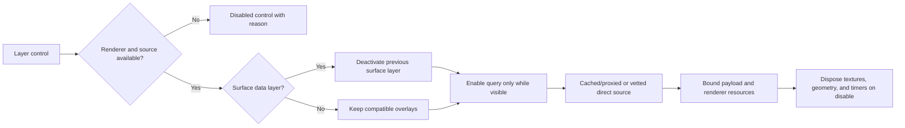

# PropSphere Layer Construction and Source Audit

**Audit date:** 2026-07-18
**Scope:** PropSphere globe, flat-map, and azimuthal layer controls, request
lifecycle, upstream durability, renderer composition, and GPU/network budgets.

## Executive result

The console flood and visual instability were not one bug. They were a group of
independent failures that became visible when several layers were enabled:

1. Weather Radar loaded 64 tiles for each of 6 frames into 4096 px canvases.
   That meant 384 tile requests and about 384 MiB of raw RGBA GPU textures,
   before browser-side canvas copies. This was sufficient to cause WebGL context
   loss on normal client hardware.
2. GOES Cloud used an unsupported NASA GIBS tile-matrix set and a daily date for
   a subdaily layer. All requests failed. The corrected matrix still has an
   advertised coverage limit, so requesting a full 4x4 world also produced four
   predictable out-of-coverage failures.
3. Band Activity Waterfall did not enable its own live-spot dependency. It
   rendered invented seed values when real feeds were empty and showed only one
   very dim sample when data did arrive.
4. Grid Activity had the same dependency-gate problem as the waterfall.
5. The menu allowed globe-only layers in flat and azimuthal renderers, creating
   silent no-ops.
6. Full-globe surface products could all be enabled together. Several
   transparent heatmaps at nearly identical radii are not scientifically or
   visually interpretable and can look like renderer corruption.
7. WSPR, lightning, and TEC were selectable even though their production
   sources were not currently authorized or operational.
8. Aurora and SST transferred far more data than their renderers used.

The branch fixes these issues rather than suppressing their errors.

## Construction after repair

### Resource budget

| Item | Before | After | Reduction |
|---|---:|---:|---:|
| Radar tiles per activation | 384 | 80 | 79% |
| Radar raw frame textures | ~384 MiB | 20 MiB | 95% |
| Radar frame canvases | 4096 x 4096 | 1024 x 1024 | 94% pixels/frame |
| GOES requests | 16 failing/partial | 12 valid | zero known bad requests |
| Aurora coordinates | 65,160 | only probability >=10 | typically >99% |
| SST grid rows | 41,472 | about 2,600 before null filtering | about 94% |

Radar's five-frame cap includes the newest observation: it loads that frame
first, then fills the other four slots sequentially from the bounded recent
set. Its scrubber now exposes only frames that are actually loaded, so selecting
an older unloaded timestamp cannot blank the globe.

## Source policy

Sources are classified as follows:

- **A - authoritative:** government or mission operator, documented endpoint,
  cacheable and suitable for normal production use.
- **B - community/operational:** useful real observations, but availability or
  usage policy is not a government-grade contract. Proxy, bound, attribute, and
  monitor it.
- **C - local/computed:** bundled reference data, deterministic astronomy, user
  records, local receiver data, or a clearly labeled empirical model.
- **Blocked:** source permission or operational validation is incomplete. The
  UI must not request or imply live data.

## Illumination and activity layers

| Layer | Views (G/F/A) | Data and source | Cadence | Class | Audit result |
|---|---|---|---|---|---|
| Day/Night | yes/yes/yes | Local solar-position astronomy | display time | C | Good |
| Greyline | yes/yes/no | Local solar geometry and propagation band | display time | C | Disabled in azimuthal |
| City Lights | yes/yes/yes | Bundled Earth night-light texture plus solar geometry | static/time | C | Good; attribution for the texture should remain in asset metadata |
| Live Spots | yes/yes/yes | [PSKReporter](https://pskreporter.info/), [HamQTH RBN feed](https://www.hamqth.com/), local WSJT-X | 30-60 s | B/C | Query is visibility-gated and bounded |
| Spot Traces | yes/yes/yes | Same observations as Live Spots | 30-60 s | B/C | Good after shared gate repair |
| FT8 Spotter | yes/yes/no | Local WASM decoder and local WSJT-X bridge | 7.5/15 s | C | No synthetic network feed; disabled in azimuthal |
| Satellites | yes/yes/no | Cached TLEs, [CelesTrak](https://celestrak.org/NORAD/elements/), [AMSAT](https://www.amsat.org/tle/current/) fallback | 6 h | A/B | Multi-source fallback exists; disabled in azimuthal |
| ISS Tracker | yes/no/no | Same TLE pipeline | 5 s positions, 6 h TLE | A/B | Globe only |
| Grid Activity | yes/no/no | Real live-spot history | 30-60 s | B/C | Fixed missing dependency gate; globe only |
| WSPR Paths | yes/yes/no | [WSPR.live](https://wspr.live/) | 2 min | Blocked | Disabled until written source permission and the existing operations gates pass |
| Beacon Network | yes/no/no | Bundled NCDXF/IARU beacon schedule | 1 s UTC state | C | Correctly local and visibility-gated |
| Meteor Showers | yes/no/no | Bundled major-shower calendar plus local radiant astronomy | daily | C | Label as schedule-based, not live meteor detection |
| Band Activity Waterfall | yes/no/no | Timestamped PSKReporter, RBN, and local decodes | 30 s | B/C | Rebuilt from real history; no fake seed; source gate fixed |
| Satellite Footprints | yes/no/no | Derived from current TLE positions and station geometry | 5 s | C | Globe only and capped |

## QSO, hazards, and atmosphere

| Layer | Views (G/F/A) | Data and source | Cadence | Class | Audit result |
|---|---|---|---|---|---|
| Contest QSOs | no/yes/no | User contest log | on change | C | Flat renderer only; other views disabled |
| Logged QSOs | no/yes/no | User logbook | on change | C | Flat renderer only; other views disabled |
| Earthquakes | yes/yes/yes | [USGS M2.5+ day GeoJSON](https://earthquake.usgs.gov/earthquakes/feed/v1.0/geojson.php) | 10 min | A | Healthy; direct client source should move behind shared edge cache before public scale |
| Weather Alerts | yes/yes/yes | [NWS active alerts API](https://www.weather.gov/documentation/services-web-api) | 10 min | A | Healthy; US-only by source definition |
| Lightning | yes/yes/yes | Proposed Blitzortung/LightningMaps raw stream | 1 min | Blocked | Disabled. [Raw data requires participant or explicit permission](https://www.blitzortung.org/en/contact.php); collector was intentionally not deployed |
| Active Fires | yes/yes/yes | [NASA FIRMS VIIRS NRT](https://firms.modaps.eosdis.nasa.gov/api/) via keyed edge proxy | 30 min | A | Healthy, server-cached, renderer capped at 5,000 instances |
| Weather Radar | yes/no/no | [RainViewer public weather maps](https://www.rainviewer.com/api.html) | 10 min | B | Healthy contract; resource budget repaired; globe only |
| GOES-East Cloud | yes/no/no | [NASA GIBS GOES-East ABI Band 13](https://gibs.earthdata.nasa.gov/layer-metadata/v1.0/GOES-East_ABI_Band13_Clean_Infrared.json) | 10 min latest | A | WMTS contract and coverage limits repaired; label now states GOES-East |
| Ionospheric TEC | yes/no/no | Retired/unavailable NOAA experimental TEC JSON path | 15 min intended | Blocked | Disabled until a durable IONEX/GIM pipeline replaces it |
| Sea Surface Temperature | yes/no/no | [NOAA OISST v2.1 via ERDDAP](https://coastwatch.pfeg.noaa.gov/erddap/griddap/ncdcOisst21Agg.html) | daily, 6 h cache | A | Internal Atmos layer; query corrected to real 5-degree stride and compact response |
| Repeaters | yes/no/no | [RepeaterBook API](https://www.repeaterbook.com/wiki/doku.php?id=api) | 30 min | B | Internal Atmos layer; empty results are valid but source should be monitored |
| River Gauges | yes/no/no | [USGS Water Services](https://waterservices.usgs.gov/) | 15 min | A | Internal Atmos layer; viewport-bounded |
| APRS | yes/no/no | [aprs.fi API](https://aprs.fi/page/api) | 1-5 min | B | Internal Atmos layer; requires server-side key and attribution |
| Tropical Cyclones | yes/no/no | [NOAA/NHC current summaries](https://www.nhc.noaa.gov/CurrentSummaries.json) | 15 min | A | Internal Atmos layer; an empty storm list is valid |

## Propagation and reference layers

| Layer | Views (G/F/A) | Data and source | Cadence | Class | Audit result |
|---|---|---|---|---|---|
| MUF | yes/yes/no | Local model driven by NOAA SFI/Kp | solar refresh | C/A | Clearly an estimate; exclusive with other global surface products |
| Aurora | yes/yes/no | [NOAA SWPC OVATION](https://services.swpc.noaa.gov/json/ovation_aurora_latest.json) | 30 min | A | Healthy; edge response now removes values below the renderer threshold |
| Ionosphere | yes/no/no | Illustrative D/E/F1/F2 shells driven by time/solar state | display time | C | Must remain labeled as visualization, not measured layer heights |
| Ray Path | yes/no/no | Local simplified ray tracing between selected endpoints | on input | C | Useful explainer, not VOACAP/PHaRLAP-grade physics |
| NVIS Coverage | yes/no/no | Local empirical SFI/Kp/time model | on input | C | Estimate only; globe/QTH dependent |
| Sporadic E | yes/no/no | Published-pattern seasonal/diurnal empirical model | hourly | C | UI corrected to “climatology”; not live GIRO/ionosonde data |
| D-RAP Absorption | yes/no/no | [NOAA SWPC D-RAP](https://services.swpc.noaa.gov/text/drap_global_frequencies.txt) | 15 min | A | Healthy and source-managed by the solar resource policy |
| Ducting Climatology | yes/no/no | Local coastal/seasonal/time empirical model | hourly | C | UI corrected; not an NWP forecast and not live refractivity |
| HF Noise Floor | yes/no/no | Local ITU-R P.372-style estimate | hourly | C | Exclusive surface layer; fixed 14 MHz should later follow selected band |
| Geomagnetic Field | yes/no/no | Illustrative dipole lines modulated by NOAA Kp | Kp refresh | C/A | Visualization, not IGRF field computation |
| Labels | yes/yes/yes | Bundled boundaries/labels | static | C | Good |
| State Borders | renderer dependent | Bundled US boundaries | static | C | Good |
| Maidenhead Grid | renderer dependent | Local grid computation | camera change | C | Good |
| Grid Labels | renderer dependent | Local grid computation | camera change | C | Good; density controls are bounded |
| Map Labels | globe/flat | Configured tile provider, OSM-derived where applicable | tile cache | B | Provider fallback and authentication handling must remain monitored |

## Composition rules

Only one exclusive quantitative surface layer may be active at a time:

`Weather Radar`, `GOES-East Cloud`, `TEC`, `SST`, `MUF`, or `HF Noise Floor`.

Turning one on now turns the previous member of that group off. Point, line,
event, path, and reference overlays remain independently composable. This is a
visualization correctness rule, not a subscription or feature gate.

## Production probes during the audit

Probe window: `2026-07-18T22:33:49Z` to `2026-07-18T22:39:01Z` from the M5.
Payload sizes are encoded response bytes. `Fallback` describes the observed
response, not whether the source has a fallback implementation.

| Product | Source time and cache evidence | Probe result | Fallback | Payload and renderer bound |
|---|---|---|---|---|
| RainViewer | Manifest generated `2026-07-18T22:30:32Z`; latest observation `22:30:00Z`; `Cache-Control: no-cache` | Manifest `200`; all z2 coordinates `x=0..3`, `y=0..3` returned `200` | no | 818-byte manifest; 16 tiles/frame; five total frames; 80-request and 20 MiB raw-texture caps |
| NASA GIBS GOES-East | `default` subdaily slot; source does not expose observation age in the tile response | All 12 supported z2 coordinates `x=0..2`, `y=0..3` returned `200` | no | 12 tiles; unsupported `x=3` is never requested; URL refreshes every 10 minutes |
| NOAA OVATION | Observation `2026-07-18T22:27:00Z`; forecast `23:47:00Z`; `max-age=60`, sampled `Age: 51` | Upstream `200`; 65,160 source coordinates, 264 at the renderer's >=10 threshold | no | 918,326-byte upstream baseline; edge emits only the 264 renderable tuples in this sample |
| NASA FIRMS | Vercel probe `Date: 2026-07-18T22:39:00Z`; cache miss during audit | `/api/fires/hotspots` returned `200` | no | 402,569 bytes; response and renderer capped at 5,000 hotspots |
| NOAA D-RAP | Product valid `2026-07-18T22:31Z`; source `Last-Modified: 22:37:53Z`, `max-age=60` | Source returned `200` | no | 42,469 bytes; solar resource cache controls renderer refresh |
| Sporadic-E model | Generated `2026-07-18T21:49:21.675Z` | Edge returned `200`, 374 empirical regions | no | 22,917 bytes; computed climatology, not an observed feed |
| Ducting model | Generated `2026-07-18T21:49:22.052Z` | Edge returned `200`, 646 empirical regions | no | 38,010 bytes; computed climatology, not an NWP forecast |
| NOAA TEC experiment | Probe `Date: 2026-07-18T22:39:01Z`; no usable observation timestamp | Edge returned `200` with `available:false` | yes | 46 bytes; zero grid cells; client source gate prevents requests |
| SST baseline | Production before merge returned the upstream daily aggregate | Edge returned `200`; compact preview required Vercel authentication | no | 2,427,205-byte/41,472-row baseline; repaired query targets about 2,600 cells before null filtering |
| Lightning | No authorized collector or source timestamp exists | Client source gate prevents the request | n/a | zero client requests and zero rendered strikes |
| WSPR | Permission gate intentionally closed | Client source gate prevents the request | n/a | zero client requests and zero rendered paths |

The exact probe commands are reproducible with `curl`, `stat`, and `jq`; tile
coordinates and caps are asserted in the committed GOES and radar unit tests.

## Remaining source upgrades

These are model/product upgrades, not blockers for the repaired layer system:

1. Replace the TEC experiment with a server-side IONEX/GIM ingestion job and
   publish an explicit observed timestamp and age.
2. Replace ducting climatology with a real refractivity forecast derived from
   pressure, temperature, and humidity profiles from a licensed NWP source.
3. Add GIRO/DIDBase or another authorized ionosonde pipeline before offering a
   live Sporadic-E observation layer.
4. Obtain explicit lightning data permission or contract with an operational
   provider. Do not deploy the current raw WebSocket collector first and ask
   later.
5. Move remaining direct browser feeds behind shared edge caching before a
   public beta, especially USGS earthquakes and NWS alerts.
6. Replace build-time source flags with a small server-side capability endpoint
   when source credentials/permissions begin changing independently of product
   deployments.

## Verification contract

Before merging or deploying a layer change:

1. Run `npm run lint`, `npm test`, `npm run build`, and `npm run check:bundles`.
2. Probe the exact upstream request contract and every bounded tile coordinate.
3. Activate the layer alone, then with compatible point/line overlays.
4. Switch among globe, flat, and azimuthal views and confirm unsupported controls
   are disabled.
5. Toggle the layer repeatedly and verify textures, timers, and requests stop.
6. Check the browser console and deployment logs for 4xx/5xx responses.
7. Record source, timestamp, cache age, fallback, payload size, and renderer cap
   in this audit whenever a layer contract changes.
