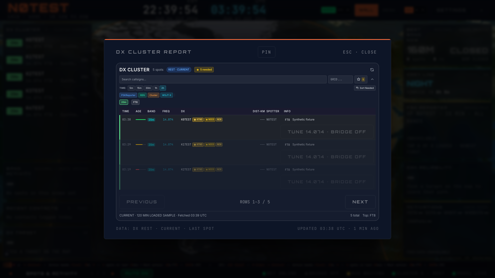
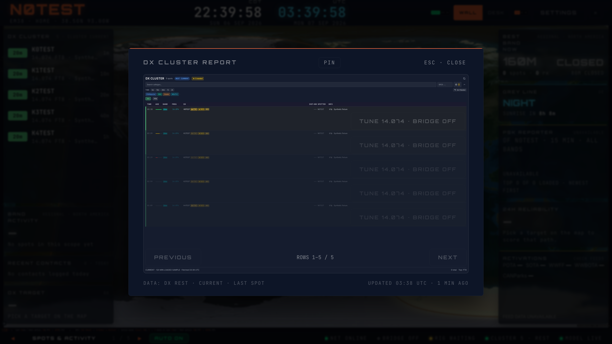

# Cluster list history, freshness and expiry — #288

The existing 5/15/30/60/120-minute list choices now request the smallest supported
source window covering the choice (15/15/30/60/120). Query identity includes the
feed contract, row limit and source window. Five-minute filtering happens locally
against the 15-minute snapshot; no choice silently reuses another window's rows.
Age eligibility advances on a ten-second clock and immediately when new source
data arrives. Invalid and future observations are withheld.

The list uses the metadata-bearing DX client. Valid empty snapshots clear prior
rows; refetch failures retain eligible cached rows with STALE state, while an
initial failure is UNAVAILABLE. Source freshness and selected history are
independent. The retrieval label uses the server's fetchedAt, not the React Query
cache update time. The report's outer footer still labels the original source
observation LAST SPOT. List/tile/report expose source state, and REST coverage is
explicitly a loaded sample rather than a complete interval total.

Only default consumers publish the passive wall snapshot. Disabled consumers
withhold public rows without overwriting another owner. External filters keep
their own REST window and may read the shared bridge rows without replacing the
default snapshot. A newly mounted empty bridge observer retains the shared live
rows; a disconnected observer cannot relabel another live owner's transport.
Existing connect/disconnect controls and shared ownership remain in place.
The passive tile also checks age independently, so an old cached bridge row
cannot remain visible solely because no owner has republished the store.

The source/client stack through #473 is required, including the existing
retention deployment prerequisite. No database, collector or renderer changes.
Legacy Cluster typography remains B11/#250 work; this slice changes source
behavior and status, not its typography acceptance.

## Verification

- 16 focused helper/hook/report tests: all request windows, exact age bounds,
  invalid/future timestamps, expiry without refetch, valid empty clearing,
  initial and cached failure, original retrieval time, query isolation,
  external/disabled consumers and bridge ownership/status.
- Lint, typecheck and production build pass. The app suite before the last
  bridge-status regression passed 389 files / 3,415 tests; final publish hooks
  verify the complete revision separately.
- Isolated Chromium: 1080p/4K × Pulse/Classic/Brass × all five age controls
  (30 cases). Loaded counts 1/2/3/4/5 and declared windows match. No measured
  report/pager overflow. Separate stale history, settled refetch failure,
  valid empty, unavailable and expiry cases pass. Expiry removes a row without
  another request; Escape restores opener focus. Final run: 14 fixture requests,
  zero page errors. Initial Vite optimizer reload occurred before fixture setup;
  the complete verification ran after that startup reload settled.

Synthetic N0TEST/EM38 and fixture APIs; disposable context, non-HMR WebSockets
blocked, no hardware services/login/production writes. Managed local owner
`hamclock-cluster-feed`, session `0e5479a9-86c8-45f6-b485-8fede59ae255`,
`http://127.0.0.1:5181/map`, isolated worktree of the same name. Root/owner/profile
checked before testing. Server stopped and exact claim released after absent PID
and free IPv4/IPv6 checks. Deployed/signed-in, physical-TV and 3D acceptance remain
separate work.

