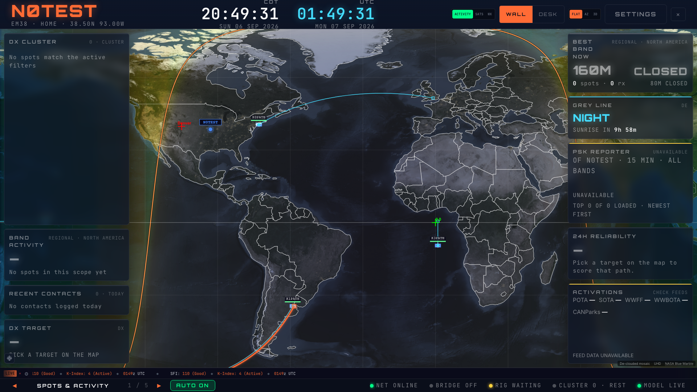
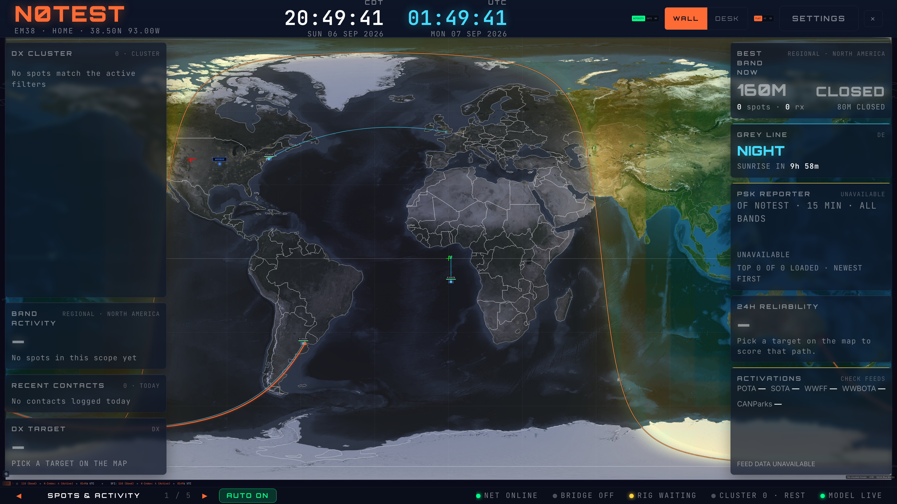

# Flat spot paths and endpoint glyphs — #288, first slice

Flat-map reception paths now follow the spherical short path. Normal, hovered,
and selected strokes share the same bounded geometry cache. A reception from the
southern hemisphere bends south when its great circle does; a date-line crossing
finishes on one map edge and resumes at the matching height on the other edge.
The reporting station (receiver) is a hollow square, and the DX station
(transmitter) is a filled circle with its existing outer ring.

The helper validates coordinates, handles coincident and antipodal endpoints,
and retains at most 512 immutable paths. Exactly antipodal stations do not have a
unique short path; the helper chooses a deterministic perpendicular direction.
Paths use at most 96 spherical intervals, split into separate canvas subpaths at
the date line. Labels retain the exact existing six-placement implementation.

This slice changes only the flat spot renderer and its new helper/tests. The
other agent retains ownership of 3D renderer internals and NowCast. Density,
shared age/source controls, and personal PSK map selection remain subsequent
slices of #288. This PR does not close the whole issue.

## Verification

- `npm run lint` and `npm run build` pass.
- Focused geometry, flat layout, and spot-layer policy: 3 files, 32 tests pass.
  Tests cover great-circle plane membership, southern/equatorial geometry,
  both date-line directions, coincident/antipodal/polar points, invalid inputs,
  cache eviction/immutability, and circle-TX/square-RX drawing commands.
- Isolated Chromium fixture: 1920×1080 and 3840×2160, DPR 1, default text size,
  Pulse/Classic/Brass; synthetic North Atlantic, southern, equatorial/meridian,
  and date-line receptions. Normal/selected paths checked in six combinations,
  plus world framing and endpoint hover. Canvas instrumentation recorded 311
  path traces, 88 selected traces, 3 hovered traces, 267 receiver squares and 534
  transmitter circles/rings. No cosmetic quadratic calls and no page errors.
- `drawCallsignLabels` is byte-for-byte identical to the parent branch (SHA-256
  `b1a206ade08faf26eb00c99c81e28cc9fc7cbb72055e322942fdc3b4ecc9fe4a`).

Diagnostic geometry-only timing in the same headless browser (one cold pass,
100 cached passes; milliseconds per pass):

| Paths | Cold | Cached |
| --- | ---: | ---: |
| 50 | 1.0 | 0.019 |
| 150 | 2.6 | 0.044 |
| 200 | 1.5 | 0.060 |

These short timings establish cache reuse, not comparative speed or a physical
frame-rate guarantee. Rasterization, labels, interaction and complete rendering
must be measured before increasing density defaults. Other agents' dev servers
were left running; this is not an isolated machine benchmark.

Browser owner `hamclock-spot-display`, session
`807c5677-e32b-443b-9a44-ed567ecf7a1d`, local profile,
`http://127.0.0.1:5181/map`; identity/root checked before each run. Disposable
context with synthetic station N0TEST/EM38, mocked API responses, no login,
non-HMR WebSockets blocked, no hardware services started. Base-map imagery is
normal public tile/static imagery. Signed-in/deployed and physical-TV checks
remain separate acceptance work.

## Polar review follow-up

Review identified an opposite-meridian path through a pole that joined the last
samples with a horizontal chord. Such paths now terminate and resume exactly at
the pole boundary. A station located at a pole uses the other endpoint's meridian
for the visible path, with separate move-only subpaths preserving the supplied
endpoint positions. Six regression cases cover north/south crossings and polar
endpoints; the focused helper suite now has 17 passing tests.
