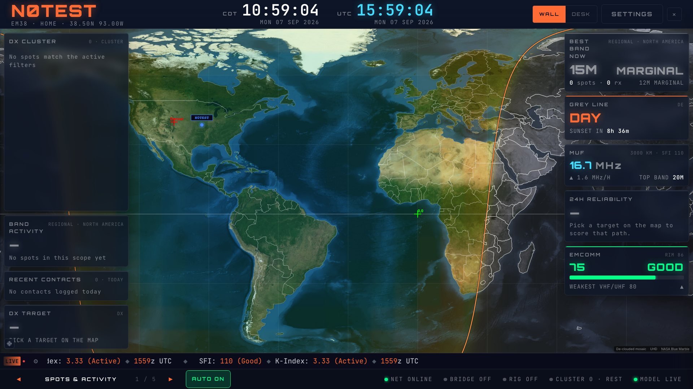
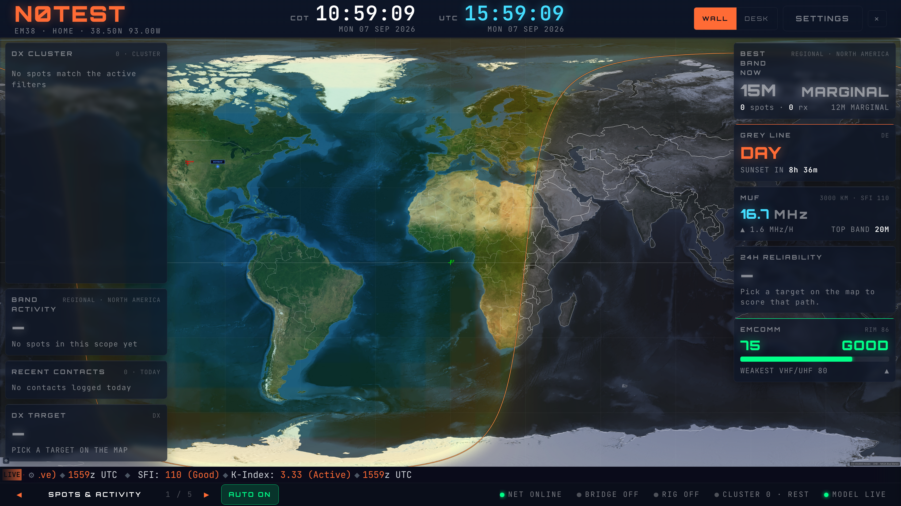

# HamClock footer and ticker readability

Owner review of #498 found AUTO ON projecting into the news crawl and crawl
text too small for a wall. AUTO ON is the rail page-cycle control. The footer
reserved 3.4vh, while the later shared toggle rule imposed a 4.8vh/44px minimum.

The footer now reserves at least 56px and scopes AUTO sizing above the shared
settings rule. AUTO and both page arrows retain 44px minimum targets. HamClock
sets ticker height and text/badge sizes through inherited CSS variables; the
shared ticker retains its existing defaults elsewhere. Wall ticker text scales
with viewport height (19.44px at 1080p, 38.88px at 4K), with a 16px floor at desk
or smaller viewports. The crawl settings target is at least 44px in HamClock.

## Verification

Thirty-six disposable Chromium cases cover Pulse/Classic/Brass, Wall/Desk,
AUTO on/off, and 1366×768 / 1920×1080 / 3840×2160. AUTO stays entirely inside
the footer, the ticker does not intersect the footer, target and text minimums
hold, and there is no footer horizontal overflow. Zero page errors. Screenshots
were inspected at 1080p and generated at 4K. Lint and production build pass.
These are browser layout checks; the owner still assesses physical readability.

The old 5182 settings preview returned no DX spots with source status unavailable.
Its worktree had no source environment configuration. A read-only check of the
existing app backend found fresh DX data. The new isolated preview has only
server-side public URL/anonymous-key configuration in ignored `.env.local`;
no service-role key, database password, client auth session or cloud write was
used. After restarting that owned preview, the endpoint returned 50 DX reports
with status ok, and a disposable browser received 50 reports with no page errors.
Other background feeds in that browser were fixture responses. This establishes
preview source access, not completeness of the separate Spots & Paths initiative.

Preview: http://127.0.0.1:5181/map, local profile. Owner
`hamclock-footer-readability`, session `3da9f865-e2fe-4355-8667-f7fe44f241a9`,
root `.worktrees/hamclock-footer-readability`. Existing user preview 5182 is
preserved. No spot presentation, model or 3D source was edited. PR is based on
#498 so it includes the settings review baseline.

