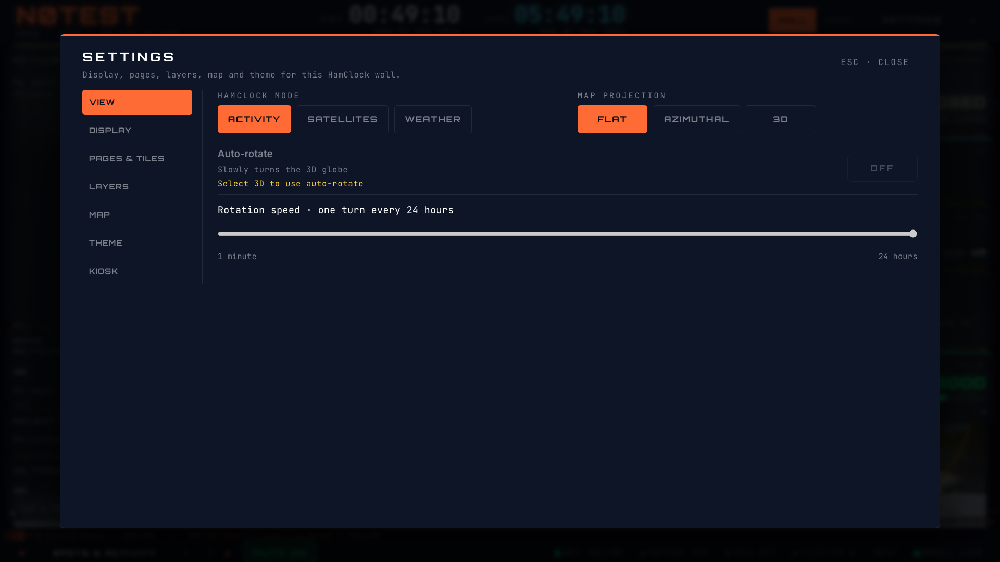
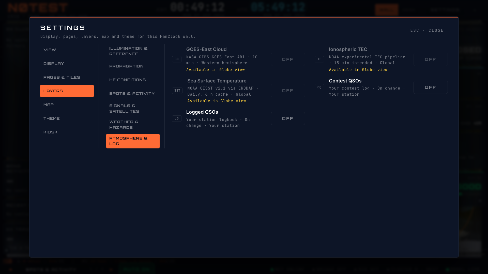

# HamClock masthead and Settings refinement

The local-zone and UTC designators sit immediately left of their clock digits,
with the date below the digits. The masthead keeps density, Settings and exit;
the small Activity/Sats/WX and Flat/AZ/3D switches now live on the first View tab
inside Settings, with larger labels.

View also exposes the existing 3D globe auto-rotate toggle and logarithmic speed
control (one turn per minute through one turn per 24 hours). Flat and azimuthal
projections show the 3D-only reason. Projection changes still update both the
live map and saved HamClock preferred projection. No renderer, model or rotation
math changed.

Settings uses a side navigation list. Layers uses a second category list beside
the layer rows, replacing wrapping rows of large tab buttons above the content.
All existing categories, source/cadence details, availability caveats and layer
toggles are retained. The tab control exposes its vertical orientation and keeps
arrow-key navigation, explicit activation, and focus return on close.

Validation: 40 focused tests passed (39 original plus the vertical-key regression). The browser layout matrix passed 117 cases
across all Settings tabs and all seven layer categories, three themes, and
1366×768, 1920×1080 and 3840×2160. Clock-label geometry and no masthead overflow
were checked at each size/theme; screenshots were visually inspected. Production
build passed. Final lint and interaction results are recorded in the PR.

