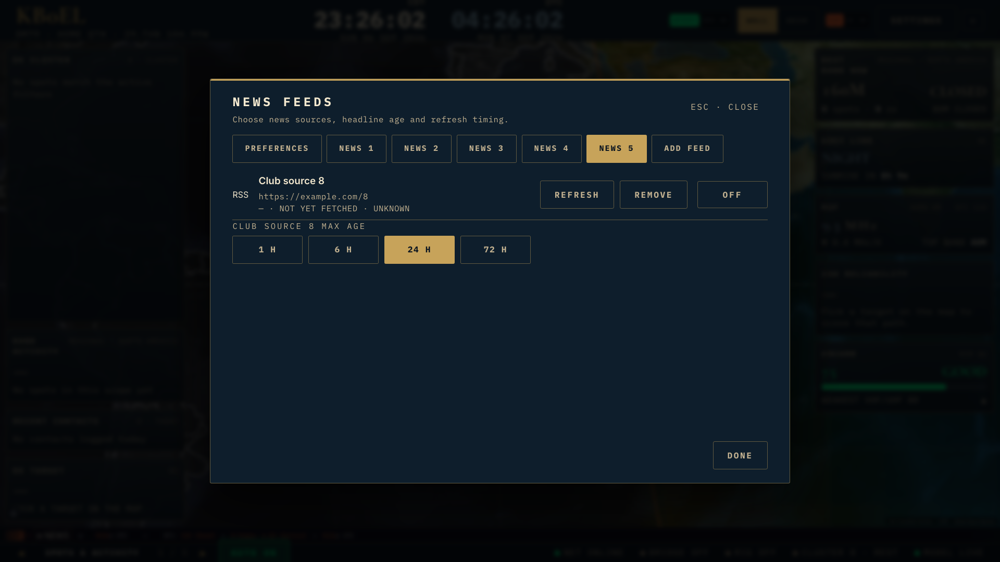

# B10 — News configuration evidence

Issue #206, HW-36/HW-37. UI PR #480, server prerequisite PR #479. Branch `feat/hamclock-b10-codex` starts at
origin/main `19b75c8b`, independently of the earlier operating-view PR stack.

The existing B0 widget registry and schema-validated store are reused. The new
WidgetConfigDialog renders registered panels through useWidgetConfig, or an
existing-store adapter such as NewsFeedsConfig. News remains in feedStore;
10/15/30/60-minute polling preferences drive both RSS hooks, per-source age and
enabled controls remain authoritative, and manual refresh exposes fetched state.
The news gear opens the centered wall dialog. The older combined dialog routes
feed additions to the verified news flow; its alert and existing-feed controls remain.

Custom feeds require a successful server `verify=1` response with a parsed title.
The same URL/redirect/body/rate-limit boundary handles verification and reading.
An edited URL invalidates verification, including late responses for older input.
Empty titled feeds are accepted; HTML/untitled documents and blocked redirects
are rejected. Item count is the normalized bounded sample (at most 50), not a
claim about every historical item. The existing five-feed add limit remains;
longer legacy collections paginate two rows per NEWS tab without scrolling.

## Validation

- 40 focused tests cover handler validation, URL races, persistence defaults,
  polling options, disabled sources and long-list pagination.
- Full `npm run verify`: 365 app files / 3,210 tests, Python/archive checks,
  bridge tests, 10 daemon tests, lint, production build and bundle budgets pass.
  The initial sandbox run could not bind a disposable daemon-test port; the
  authorized rerun passed without starting a real daemon or hardware service.
- Disposable Chromium: 30 cases across 1920×1080 and 3840×2160, pulse/classic/brass,
  preferences/source/add tabs and nine-source pagination. No dialog overflow or
  page errors. Verify-before-add, parsed title saving, persisted 30-minute timing,
  disabled-source manual refresh, fetched timestamp and Escape focus restoration
  pass. Five mocked RSS requests; browser accesses only the app RSS endpoint.
- After screenshot review, unfetched state says UNKNOWN and each source shows its
  URL. The complete browser matrix passed again after that correction.

Browser session: owner `hamclock-b10-codex`, profile local, port 5181,
ID `91de6a57-d5b6-4874-b530-6bc20b5e9ce0`. All non-HMR WebSockets were blocked.
Feed/API responses were fixtures; no real RSS availability, account sync, radio
hardware or physical display readability is claimed.

Acceptance follow-up: the older combined dialog's unverified add form was removed
in favor of the verified news handoff. A regression checks the absent URL form,
handoff callback and retained alert controls; 17 targeted UI tests pass. The
server verification is isolated in PR #479 (`feat/hamclock-b10-feed-verify`, two files),
with the UI stacked on that prerequisite to keep register updates within the
15-file PR limit. No additional batch is claimed.

The legacy-entry-point browser rerun also passed the complete 30-case matrix,
with no unverified URL form, successful handoff to NEWS FEEDS, and Escape focus
restored to the original combined-settings gear. This used local owner
`hamclock-b10-codex`, port 5181, session
`59d38514-abb4-4dfe-b40c-d68c3d0380ea`; its server was stopped after verification.
The prerequisite PR #479 separately passed full verification: 364 app files /
3,205 tests plus the remaining required checks.

Final UI push verification passes: 365 app files / 3,211 tests, with all remaining required gates passing. Register statuses in this branch describe the delivered behavior upon merge; the board remains In review until maintainer acceptance.
