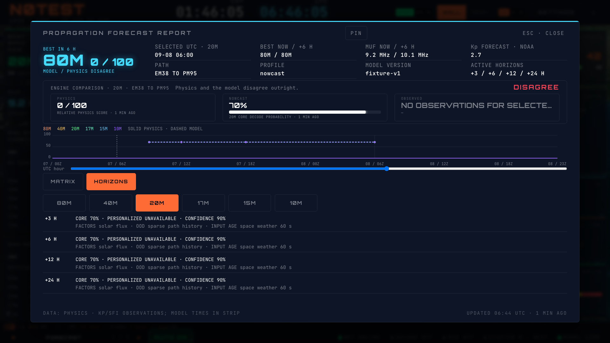

# HamClock Propagation Forecast report — B18 / HW-59

The Forecast Matrix tile opens a dedicated, pinnable report. Its summary shows the highest physics-scoring band six hours ahead, its relative score, and model/physics agreement only when matching model evidence exists. The chart covers the current and next UTC calendar day, with six physics band scores, a now marker and model points only at permitted FutureCast horizons. This is two UTC days, not a promise of 48 future hours from the current moment.

MATRIX provides a day selector and 24 hourly columns per day. Both days retain all six bands (288 values in the screen-reader table); the visible cells remain at least 44 × 44 pixels. Selecting a cell or moving the chart's keyboard/pointer control updates the band/hour readout. The dialog fits within 90vw × 88vh without a scrolling region.

HORIZONS always includes +3, +6, +12 and +24 hours. Available responses show core probability, personalized probability only when a station envelope was actually sent, confidence, word-expanded factors and OOD flags, and supplied input ages. Missing or disabled horizons retain MODEL OFF and a reason. The chart and selected-hour model readout use the same core/personalized choice. Scoped spot counts remain evidence and are excluded from path-agreement classification.

## Data boundaries and remaining work

- Existing model capability and runtime gates decide which horizons may be requested. This report cannot activate them. Capability revocation also hides cached responses.
- Requests use the established station envelope and feature builder, recalculated at each valid time while retaining the issue time and observation freshness. Reliability mathematics and modeling internals are unchanged.
- Model responses must match band, target, mode and valid hour, pass probability/metadata validation, and have a recent issue time. A stale response or refresh failure retains a warning. A current response is never extended across future hours.
- Physics uses the existing two-day computation and current Kp/SFI observations. The separate Kp FORECAST fact reuses the full NOAA K-index resource, accepts only predicted points covering the selected three-hour interval, and marks stale values. It does not substitute observations for missing forecasts or alter the physics inputs.
- Historical model/observed series and hop count remain the separate HW-58 gaps documented in the Reliability report. No synthetic values replace missing source data.

## Validation so far

Eight focused tests cover future-time feature construction, capability revocation, disabled horizons, both matrix days, and core/personalized chart/readout consistency including stale metadata, plus NOAA bucket boundaries and observation/forecast separation. The required wall suite passed all 328 tests in 32 files. TypeScript compilation passes. The browser matrix passed 24 MODEL OFF cases and 24 populated-model cases across QTH/target, three themes, 1080p/4K and both tabs. It checks all 288 cell labels across both days, 44px minimum hit targets, 90vw × 88vh limits, no overflow, selection and focus return. No page errors occurred. Browser data was synthetic in an isolated local context; this is not evidence that live FutureCast horizons are released.

The mandatory pre-push verification runs before publication; its final outcome is recorded in the PR.

