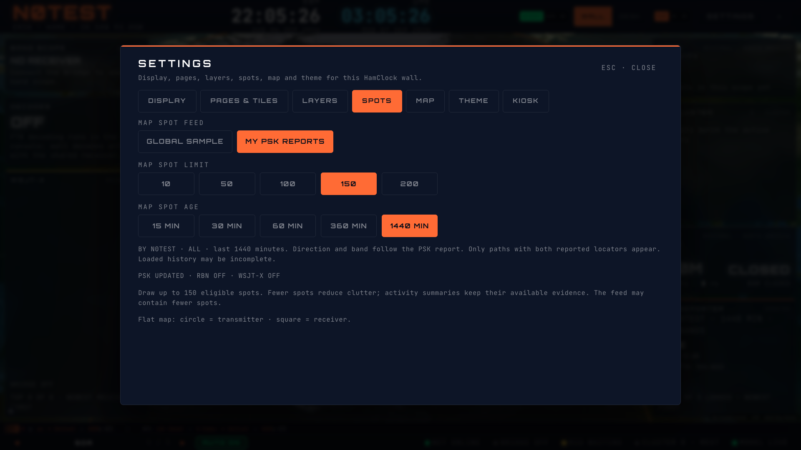
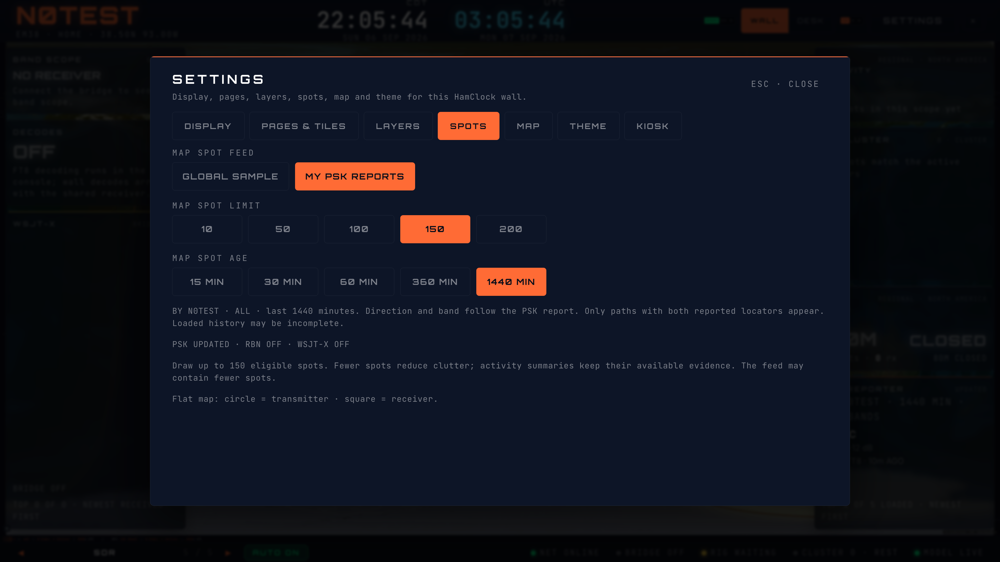

# Personal PSK map coordination — #287 / #288

PSK Report → SHOW ON MAP selects a session-only personal feed and closes the
report. Its OF/BY direction, band, and 15/30/60/360/1440-minute window now drive
the shared map feed. The action enables spots and, from Contacts-only display,
selects Both so contacts remain visible. Settings → Spots distinguishes GLOBAL
SAMPLE from MY PSK REPORTS and shares the personal age control. Returning to the
global feed preserves its separate 15/30/60 preference and source/profile filters.

Personal data comes from the existing bounded callsign-specific snapshot, never
from the sampled global feed. Distinct receiving-station paths retain original
RF frequency and observation time; exact duplicate paths are collapsed. Both
reported Maidenhead locators are required, including four/six/eight-character
locators. Missing coordinates are not replaced with country centroids. TX maps
to the existing circle endpoint and RX to the square. The shared resolver applies
the report's personal filters independently of global source/band/mode choices.
The existing density cap still applies after coordinate resolution.

Public-assistance policy disables personal network requests and suppresses even
cached personal paths in restricted operation. Settings reports RESTRICTED;
source failures remain unavailable or stale. An unavailable initial snapshot is
not ready to seed trace history. Trace scope includes call, direction, band,
window and policy. Expiry follows the shared PSK clock and remains independent
of the five-minute refresh. Loaded history can be incomplete; maps also exclude
reports lacking both locators. This does not promise complete 24-hour coverage.

The shared boundary changes; 3D renderer internals, callsign placement and radio
command behavior are unchanged. The #422 service-role cache migration and
configuration are still deployment prerequisites, not applied by this change.
Global six-hour/24-hour history and DX Cluster list integration remain separate.

## Verification

- 27 focused helper, hook, resolver, Settings, report and PSK-client tests pass.
  Coverage includes distinct receiver paths, invalid/missing locators, eight-
  character coordinates, RF/time preservation, both directions and all five
  windows, band scope, clock expiry, trace identity, restricted cached data,
  unavailable initial snapshots, global-filter isolation, keyboard controls,
  contacts-only transition, and no tuning from the map action.
- Lint, typecheck and production build pass. Full app suite before the final
  unavailable-readiness regression passed 386 files / 3,390 tests; required
  publish hooks verify the final revision separately.
- Isolated Chromium: 1920×1080 and 3840×2160 × Pulse/Classic/Brass × both
  directions × all five windows (60 report-to-map cases). Actual flat live-layer
  instrumentation records 1/2/3/4/5 paths as expected, even with global RBN-only
  selection. Report and Settings fit without internal overflow, SHOW ON MAP
  restores opener focus, and Settings Home/Escape preserve keyboard focus.
- Final run: zero page errors; two initial development-mount requests and no
  requests from the 60 filter/action cases after the initial snapshot settled.
  All API data is synthetic N0TEST/EM38 with fixture endpoints. Non-HMR
  WebSockets blocked; no login, hardware services or production writes.

Managed local session: owner `hamclock-psk-map`, ID
`d36f080a-c876-4716-a754-85e09ae77a7c`, this isolated worktree,
`http://127.0.0.1:5181/map`. Root/owner/profile verified before use; owned server stopped and its exact claim
released after checking absent PID and free IPv4/IPv6 listeners. Public base
imagery is normal. Deployed/signed-in, physical-TV and 3D performance acceptance
remain separate work.

