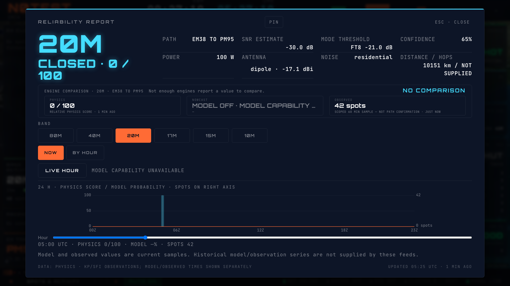

# HamClock Reliability report — B18 / HW-58

The Reliability tile opens a dedicated, pinnable report with NOW and BY HOUR views. The selected band/hour drives the hero, status, relative physics score, SNR and confidence. Power, antenna pattern/path gain, noise environment and mode threshold come from the same inputs used by the existing reliability calculation.

The full six-band, 24-hour grid has 144 selectable cells and a screen-reader table. The chart shares one UTC axis across physics scores, matched NowCast probabilities and scoped trailing-60-minute spot samples. Counts use a separate scale and do not count as path confirmation or calibrated engine agreement. Pointer and keyboard selection expose all three values.

## Source boundaries

- No target uses the existing station-local physics calculation and says NO TARGET — SHOWING QTH. It does not manufacture path SNR or confidence.
- Model evidence must match the active station, band, target, mode and selected UTC hour; it must be a model response rather than physics fallback, with valid probabilities and an issue age at most 15 minutes. Disabled/unavailable model capability stays unavailable.
- Only current model and observation samples exist in these feeds. Missing historical values remain gaps, rather than stretching today's sample across the chart. Observations retain their source hour and public assistance policy applies to requests and cached reads.
- Hop count is not supplied by the reliability cell contract; the distance fact explicitly says NOT SUPPLIED for hops. Reliability mathematics and model/runtime gates are unchanged.
- The footer uses the older Kp/SFI observation timestamp. Model and observed columns display their own timestamps.

## Verification

30 focused tests cover station inputs, source timestamps, evidence rejection, horizon gaps, grid selection, screen-reader output keyboard chart selection and pointer selection with SVG aspect-ratio gutters. Lint and production build pass. The isolated browser matrix covers target and QTH states × pulse/classic/brass × 1080p/4K × NOW/BY HOUR (24 cases), populated scoped counts, all 144 grid buttons, cell selection and Escape focus return. No browser page errors or report overflow occurred. Screenshots were also inspected to catch overlapping notes and undersized axes that container overflow checks alone missed.

The Forecast portion (HW-59) remains a separate B18 review slice; this report does not complete issue #226 by itself.

