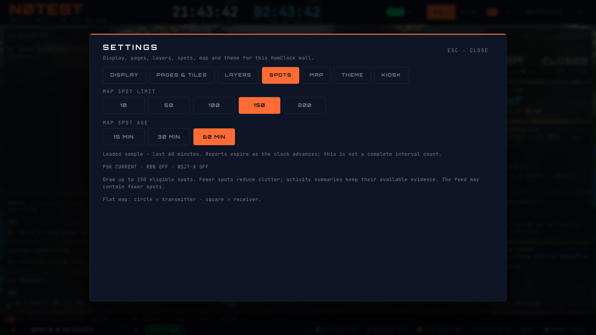
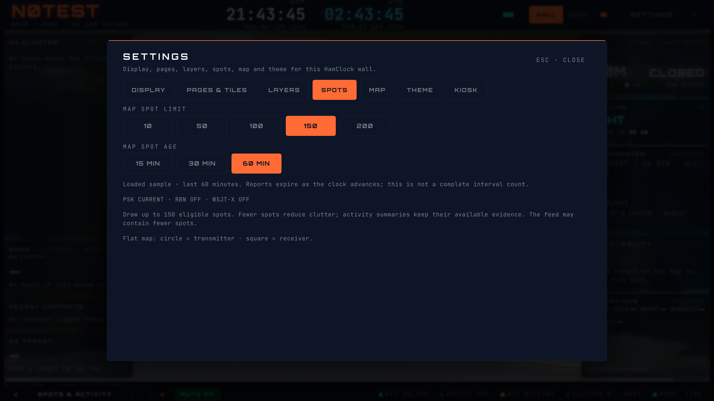

# Map spot age and expiry — #288

HamClock Settings → Spots now offers map-specific 15/30/60-minute age choices,
defaulting to 30 and persisted locally. The shared map feed requests the selected
window through the validated browser contract, keeps source metadata, and filters
original observation timestamps against a running clock. Cached reports expire
within the ten-second tick without another fetch. New query snapshots and local
decodes advance that clock immediately so fresh arrivals do not wait for a tick.

Age applies before visual deduplication and coordinate resolution, so drawn
reports and map activity evidence share eligibility. The render cap still does
not reduce the available evidence snapshot. Each window has its own query and
trace scope identity; changing windows cannot treat a recovered old snapshot as
newly arriving trace evidence. Query keys include a feed-contract version to
avoid confusing old array cache entries with metadata-bearing feed objects.

Settings shows per-source state: CURRENT, STALE, UNAVAILABLE, UNKNOWN, loading,
off, or the local WSJT-X bridge state. A refetch failure with cached data stays
stale rather than becoming an empty successful feed. Source freshness remains
independent of the selected interval. Copy explicitly describes a loaded sample,
not complete interval totals. The map and Settings share the lightweight
`useMapSpotFeed` policy/request hook; Settings does not import renderer geometry.

This updates the shared feed boundary for map projections without editing 3D
internals or callsign placement. DX Cluster's separate list time controls and
personal PSK OF/BY map scope remain follow-up integration work. Global 6h/24h is
not exposed. The stacked source/client prerequisites must be deployed together;
an older endpoint cannot silently satisfy the explicit window contract.

## Verification

- 27 focused helper/hook/settings tests pass: inclusive time bounds, future and
  invalid observations, clock expiry, new arrivals between ticks, trace scope,
  source states, source/operating policy, persisted selection and keyboard focus.
- Typecheck, lint and production build pass. No budget or policy threshold changed.
- Isolated Chromium: 1366×768, 1920×1080, 3840×2160 × Pulse/Classic/Brass ×
  15/30/60 minutes (27 combinations). Browser-only canvas instrumentation confirms
  actual rendered counts of 2/3/4 from the corresponding synthetic snapshots.
  Dialog/controls fit without scrolling; Home selects/focuses 15 MIN and Escape
  returns focus to Settings. Persisted selection checked.
- Separate stale and unavailable scenarios show the correct PSK source state;
  stale history remains drawable in its selected window. A near-expiry report
  disappears without a new request. Final run: 11 explicit-window requests across
  the scenarios, zero page errors. Source/API fixtures and synthetic N0TEST/EM38;
  no login, production data writes, or hardware services.

Owner `hamclock-spot-age-map`, local-profile session
`75fe06c6-d77c-489f-b8a6-bee0d6210356`, `http://127.0.0.1:5181/map`, this isolated
worktree. Identity checked before testing; disposable browser context with
non-HMR WebSockets blocked. Public base imagery is normal. Signed-in/deployed,
physical-TV and 3D performance acceptance remain separate work.

