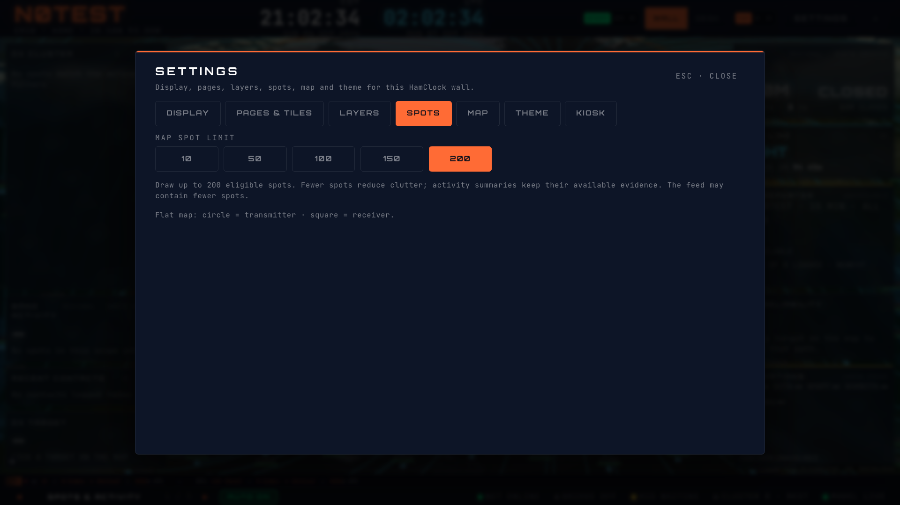
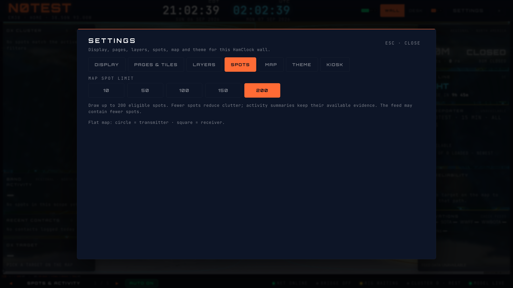

# Spot density — #288

The shared map render cap now defaults to 150 instead of 50. HamClock Settings →
Spots offers 10/50/100/150/200 through the existing keyboard-accessible segmented
control. An intermediate desktop-slider value appears as a selected additional
choice until the operator changes it; opening Settings never silently replaces it.
The setter clamps to a whole 10–200 and falls back to 150 for non-finite input.

The map's shared resolution hook continues fetching its bounded source snapshot
independently of the render cap. Activity evidence remains separate from draw
capacity. The general live-spot hook retains its existing minimum of 50 per source
for analysis consumers. Fractional source request limits are now rounded down.
The cap is a maximum, not a promise of that many available eligible locations.

No 3D renderer or model internals change. This slice retains existing source,
band and age semantics. Age windows and personal PSK map selection remain later
work under #288. The parent #426 also carries the reviewed polar-path correction.

## Validation

Focused density/settings tests pass (11 tests): keyboard changes propagate to the
shared cap without changing band filters, intermediate values survive, invalid
values normalize, source request bounds remain, and the seventh Settings tab
preserves dialog behavior. Lint and production build pass.

Isolated Chromium: 1366×768, 1920×1080 and 3840×2160, DPR 1, default text size;
Pulse/Classic/Brass. Nine combinations, five cap choices each. Instrumented
renderer counts match each selected cap, all controls meet 44×44 pixels, dialog
and controls fit without scrolling, Home changes selection and focus, and Escape
returns focus to Settings. No page errors. Synthetic 200-report PSK feed with
unique world-wide locators, N0TEST/EM38, local profile, API fixtures, no login or
hardware services; non-HMR WebSockets blocked. Public base imagery remains normal.

Owner `hamclock-spot-density`, session `6451a8f0-7cf8-49f8-931c-4ee354f7f25a`,
`http://127.0.0.1:5181/map`, this isolated worktree; identity checked before runs.

## Render measurements before raising the default

Browser-only response instrumentation bracketed the entire live canvas layout
effect (paths, endpoints, labels, markers and context restore). No timing code was
added to application source. Thirty explicit repaint triggers per density and
resolution produced 61–66 actual live-layer paints, all with the expected count.
The first insufficient-repaint fixture was discarded and corrected to assert
at least 30 observed paints per case.

| Viewport | Cap | Median live paint, ms | P95, ms | Maximum, ms |
| --- | ---: | ---: | ---: | ---: |
| 1080p | 50 | 0.30 | 0.50 | 0.60 |
| 1080p | 150 | 0.80 | 1.00 | 1.00 |
| 1080p | 200 | 1.10 | 1.30 | 1.40 |
| 4K | 50 | 0.30 | 0.50 | 0.50 |
| 4K | 150 | 0.80 | 0.90 | 1.00 |
| 4K | 200 | 1.00 | 1.20 | 1.30 |

These measurements support the bounded 150 default and keeping 200 optional for
the tested flat renderer. They measure JavaScript canvas submission with warm
geometry, not GPU completion, cold tile loading or physical-TV frame rate.
Two-animation-frame elapsed medians ranged 38–53 ms at 1080p and 135–212 ms at
4K, with no reliable monotonic comparison at 4K. Other agent servers remained
running and the machine was not isolated. Physical display and 3D performance
acceptance remain open; no performance threshold was relaxed.

