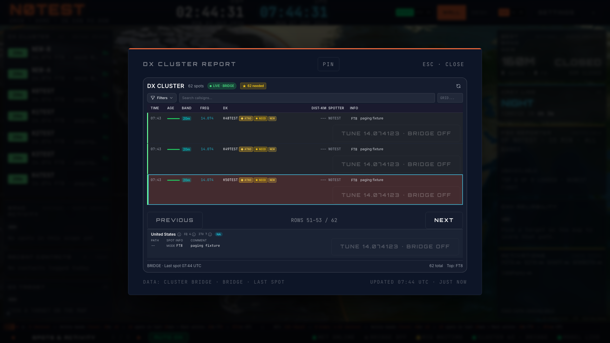

# HamClock spot review corrections

This follow-up to #478 addresses review findings on #417, #418, #474, and
#478. It belongs to the existing #288 operating/spot batch and does not change
modeling, globe internals, or weather.

- Disabled activation observers stop their expiry timer. Enabled observers use
  their own ten-second cadence instead of subscribing to the masthead's shared
  one-second clock. Query polling also stops while disabled.
- A renewed activation with the same program/callsign/reference replaces an
  expired selected report before the selection is cleared.
- Bridge reports may be at most sixty seconds ahead of the receiving clock.
  Parsing, merging, rendering, and shared-cache cleanup use the same bound.
  REST timestamps retain their existing strict bound.
- The full DX report follows a newly selected spot onto its visible page. Later
  pages and keyboard focus track spot IDs through live insertions. The first
  page remains live; manual paging remains available while a spot is selected.
  Removing the focused spot clears keyboard identity instead of targeting the
  row that inherited its index.

## Validation

Focused regressions reproduce the old activation renewal, clock subscription,
bridge timestamp, and numeric-page failures before the fixes. The final focused
suite contains 38 passing tests across six files. TypeScript, lint, and the
production build pass.

The disposable Chromium fixture uses 60 synthetic bridge reports, selects report
45 before opening the dialog, navigates to a later page, prepends two reports,
checks stable row IDs and keyboard identity, then checks that Next does not
repeat those rows. A subsequent external selection of report 50 stays visible
through 1080p → 4K → 1080p resizing. Escape returns focus to the opener. No page
errors occurred. Synthetic WebSockets are intercepted; no hardware service is
started, and no tuning command is sent. These checks establish local UI behavior,
not authenticated sync or physical-display readability.

Test checkout: `.worktrees/hamclock-spot-review`, branch
`fix/hamclock-spot-review`. Managed local server owner `hamclock-spot-review`,
session `2072480c-4c38-4bf5-aedb-87ead6d17987`, origin
`http://127.0.0.1:5181`, root/profile/owner verified by the fixture. The separate
masthead/settings preview at port 5182 is preserved.
