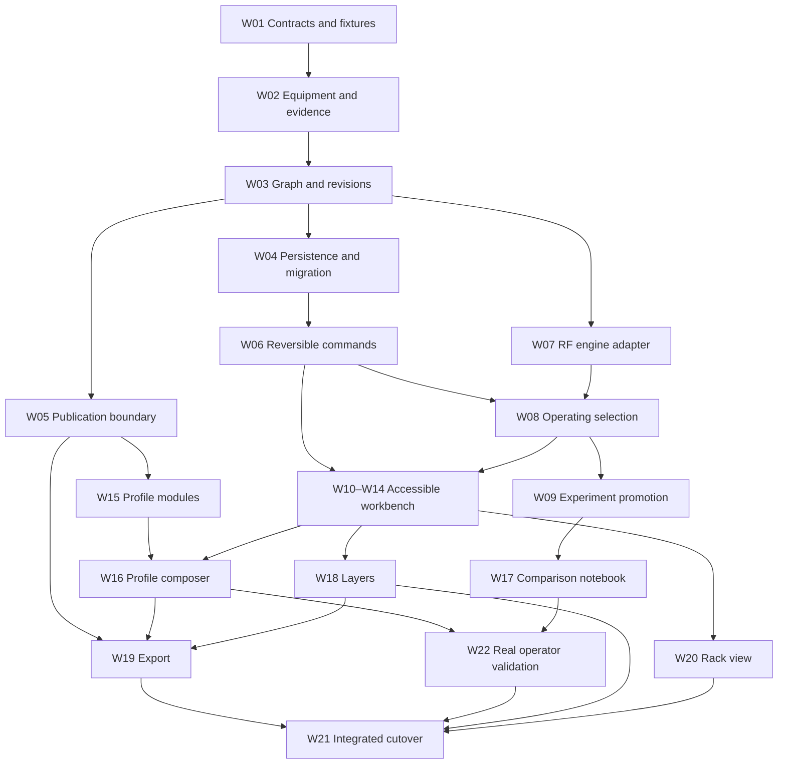

# Station Workbench delivery plan

Approved direction: 5 September 2026. This dependency-first plan supersedes the original proposal's user-facing release order. There are no live product users yet; establish shared technical foundations before polishing dependent interfaces. Existing owner/development data still requires migration and recovery.

[GitHub project](https://github.com/users/crypticpy/projects/3) · [Parent delivery issue](https://github.com/crypticpy/propulse/issues/173) · [Approved proposal](README.md) · [Requirement acceptance register](PUNCH-LIST.md) · [Machine-readable register](delivery-plan.json)

## Scope and accountability

All 17 requirements S01–S17 are included in 22 implementation work packages. The optional rack/bench view remains tracked as W20, not silently deferred. The parent represents delivery of the full redesign; publishing these planning documents does not close it. HamClock display work is excluded.

@crypticpy is the accountable coordinator and issue assignee. Implementation starts unclaimed. A worker comments with their identity, branch, isolated worktree and file scope before starting. Use the project's Status for Todo/In Progress/Done and Readiness for Ready/Blocked/In review/Verified. These are maintained by the worker/coordinator; they are not an automatic dependency scheduler. Only W01 starts Ready. Update readiness after prerequisites have delivered their contracts and evidence.

Every issue includes acceptance criteria, prerequisite links, verification, and a completion contract. A **Delivery evidence** comment must link merged PRs/commits, checklist results, commands/results, UI/export evidence as applicable, and unresolved blockers. A PR may use `Closes #N` only when it completes all criteria; partial PRs use `Refs #N`. A phase is complete only when all its issues and gate evidence are complete. Post phase signoff on the parent before closing its milestone. W21 is the final cutover gate. Do not mark Done because code exists or a bot is quiet.

No due dates or capacity commitments have been invented. Scope changes require explicit owner approval linked from the parent, affected issue, and this register; closing a deliverable as not planned is not delivery. Keep all requirement IDs traceable even when a work package is split.

## Design foundation review gate

[Foundation child issue #219](https://github.com/crypticpy/propulse/issues/219) tracks the approved design tokens, reusable component library and working equipment review page under W01. See the [library contracts and browser evidence](../station-ui/README.md). The foundation shipped in PR #220 and the owner approved the working page and visual direction. The owner subsequently authorized Codex to coordinate the remaining refactor with agents, preserving existing features. This child does not replace any of the 22 work packages or complete W01's domain contracts. HamClock work remains independently owned.

## Implementation contracts and preservation gate

W01 records the [domain/lifecycle/migration decisions](DOMAIN-DECISIONS.md), [editor architecture](EDITOR-ARCHITECTURE.md), [executable contract examples](../../../src/lib/station/workbench/README.md), and [existing feature preservation register](FEATURE-PRESERVATION.md). Every later shack/profile surface uses the published station-ui library and its visual-comfort rules. Agent assignments name bounded file scopes; the coordinator reviews integration and bot feedback before merge.

Each preservation row needs a destination and passing evidence before the old feature is retired. This includes metadata, operating/logging/forecast consumers, profile/social behavior, media and access boundaries, not just visible cards. A source audit is not passing parity evidence. W21 verifies this register alongside S01–S17; newly discovered features are added rather than silently omitted. Existing defects may be corrected explicitly with tests, while the useful capability is retained.

## Technical phases

Phases describe prerequisite maturity, not separately marketed feature releases. Independent branches of the graph can proceed in parallel once their own blockers clear; a phase number alone does not imply every issue in the prior phase blocks it.

<!-- workbench:phases:start -->
| Phase | Milestone | Exit evidence |
|---|---|---|
| P0 | [Contracts and executable fixtures](https://github.com/crypticpy/propulse/milestone/1) | Agree domain boundaries, review representative fixtures, and choose the editor architecture before downstream implementation. |
| P1 | [Durable data and access boundaries](https://github.com/crypticpy/propulse/milestone/2) | Typed models, revisioned storage, migration/recovery, provenance, and publication projections pass contract tests. |
| P2 | [Graph and operating services](https://github.com/crypticpy/propulse/milestone/3) | Reversible commands, route evaluation, pinned operating selection, and reviewed promotion work without UI coupling. |
| P3 | [Workbench integration and accessible editing](https://github.com/crypticpy/propulse/milestone/4) | Inventory, canvas/list editing, guided construction, and evidence-aware results use the same services. |
| P4 | [Profile and alternate graph views](https://github.com/crypticpy/propulse/milestone/5) | Profile composition, notebooks, extra layers, export, and rack arrangement reuse established data and permission contracts. |
| P5 | [Integrated verification and cutover](https://github.com/crypticpy/propulse/milestone/6) | Real operator validation and integrated data/access/release evidence meet the agreed gates; all S01–S17 remain accounted for. |
<!-- workbench:phases:end -->

## Dependency map

The table below and native GitHub blocked-by links are the exact graph. This diagram summarizes the branches.

## Work packages and exact prerequisites

<!-- workbench:packages:start -->
| Work package | Phase | Blocked by | Delivers |
|---|---|---|---|
| [W01 · #174](https://github.com/crypticpy/propulse/issues/174) Define domain contracts and representative station fixtures | P0 | None — ready to claim | S01, S02, S03, S04, S05, S06, S07, S08, S09, S10, S11, S12, S13, S14, S15, S16, S17 |
| [W02 · #175](https://github.com/crypticpy/propulse/issues/175) Implement equipment, ports and provenance contracts | P1 | [W01 · #174](https://github.com/crypticpy/propulse/issues/174) | S08, S11, S13, S14 |
| [W03 · #176](https://github.com/crypticpy/propulse/issues/176) Implement setup graph, revisions and separate layouts | P1 | [W01 · #174](https://github.com/crypticpy/propulse/issues/174), [W02 · #175](https://github.com/crypticpy/propulse/issues/175) | S01, S03, S05, S08, S09, S15, S17 |
| [W04 · #177](https://github.com/crypticpy/propulse/issues/177) Persist and migrate revisioned station data safely | P1 | [W02 · #175](https://github.com/crypticpy/propulse/issues/175), [W03 · #176](https://github.com/crypticpy/propulse/issues/176) | S01, S05, S08, S11, S13, S15 |
| [W05 · #178](https://github.com/crypticpy/propulse/issues/178) Enforce audience projections and media access | P1 | [W01 · #174](https://github.com/crypticpy/propulse/issues/174), [W02 · #175](https://github.com/crypticpy/propulse/issues/175), [W03 · #176](https://github.com/crypticpy/propulse/issues/176) | S06, S12, S16 |
| [W06 · #179](https://github.com/crypticpy/propulse/issues/179) Build transactional graph commands and undo/redo | P2 | [W03 · #176](https://github.com/crypticpy/propulse/issues/176), [W04 · #177](https://github.com/crypticpy/propulse/issues/177) | S02, S03, S04, S08, S10 |
| [W07 · #180](https://github.com/crypticpy/propulse/issues/180) Compile selected RF routes into the existing engine | P2 | [W02 · #175](https://github.com/crypticpy/propulse/issues/175), [W03 · #176](https://github.com/crypticpy/propulse/issues/176) | S06, S08, S09, S13, S14 |
| [W08 · #181](https://github.com/crypticpy/propulse/issues/181) Pin operating context to reviewed setup revisions | P2 | [W04 · #177](https://github.com/crypticpy/propulse/issues/177), [W06 · #179](https://github.com/crypticpy/propulse/issues/179), [W07 · #180](https://github.com/crypticpy/propulse/issues/180) | S01, S05 |
| [W09 · #182](https://github.com/crypticpy/propulse/issues/182) Implement isolated experiments and reviewed promotion | P2 | [W04 · #177](https://github.com/crypticpy/propulse/issues/177), [W07 · #180](https://github.com/crypticpy/propulse/issues/180), [W08 · #181](https://github.com/crypticpy/propulse/issues/181) | S05, S13, S15 |
| [W10 · #183](https://github.com/crypticpy/propulse/issues/183) Connect practical inventory to the new services | P3 | [W02 · #175](https://github.com/crypticpy/propulse/issues/175), [W04 · #177](https://github.com/crypticpy/propulse/issues/177), [W06 · #179](https://github.com/crypticpy/propulse/issues/179) | S03, S07, S11 |
| [W11 · #184](https://github.com/crypticpy/propulse/issues/184) Build the station canvas and connection inspector | P3 | [W06 · #179](https://github.com/crypticpy/propulse/issues/179), [W07 · #180](https://github.com/crypticpy/propulse/issues/180), [W08 · #181](https://github.com/crypticpy/propulse/issues/181), [W10 · #183](https://github.com/crypticpy/propulse/issues/183) | S02, S04, S08, S09 |
| [W12 · #185](https://github.com/crypticpy/propulse/issues/185) Deliver full list, keyboard and touch parity | P3 | [W06 · #179](https://github.com/crypticpy/propulse/issues/179), [W11 · #184](https://github.com/crypticpy/propulse/issues/184) | S03, S04, S10 |
| [W13 · #186](https://github.com/crypticpy/propulse/issues/186) Add guided construction using the same editor | P3 | [W10 · #183](https://github.com/crypticpy/propulse/issues/183), [W11 · #184](https://github.com/crypticpy/propulse/issues/184), [W12 · #185](https://github.com/crypticpy/propulse/issues/185) | S04, S07, S10, S11 |
| [W14 · #187](https://github.com/crypticpy/propulse/issues/187) Present estimates and measured evidence honestly | P3 | [W02 · #175](https://github.com/crypticpy/propulse/issues/175), [W07 · #180](https://github.com/crypticpy/propulse/issues/180), [W09 · #182](https://github.com/crypticpy/propulse/issues/182), [W11 · #184](https://github.com/crypticpy/propulse/issues/184) | S06, S13 |
| [W15 · #188](https://github.com/crypticpy/propulse/issues/188) Define profile modules and customization persistence | P1 | [W01 · #174](https://github.com/crypticpy/propulse/issues/174), [W05 · #178](https://github.com/crypticpy/propulse/issues/178) | S12 |
| [W16 · #189](https://github.com/crypticpy/propulse/issues/189) Build profile composition and audience preview | P4 | [W05 · #178](https://github.com/crypticpy/propulse/issues/178), [W14 · #187](https://github.com/crypticpy/propulse/issues/187), [W15 · #188](https://github.com/crypticpy/propulse/issues/188) | S06, S12 |
| [W17 · #190](https://github.com/crypticpy/propulse/issues/190) Add named comparison notebooks and revision recall | P4 | [W09 · #182](https://github.com/crypticpy/propulse/issues/182), [W14 · #187](https://github.com/crypticpy/propulse/issues/187) | S05, S13, S15 |
| [W18 · #191](https://github.com/crypticpy/propulse/issues/191) Add optional typed station documentation layers | P4 | [W02 · #175](https://github.com/crypticpy/propulse/issues/175), [W06 · #179](https://github.com/crypticpy/propulse/issues/179), [W07 · #180](https://github.com/crypticpy/propulse/issues/180), [W12 · #185](https://github.com/crypticpy/propulse/issues/185) | S09, S14 |
| [W19 · #192](https://github.com/crypticpy/propulse/issues/192) Export sanitized diagrams and connection schedules | P4 | [W05 · #178](https://github.com/crypticpy/propulse/issues/178), [W12 · #185](https://github.com/crypticpy/propulse/issues/185), [W14 · #187](https://github.com/crypticpy/propulse/issues/187), [W16 · #189](https://github.com/crypticpy/propulse/issues/189), [W18 · #191](https://github.com/crypticpy/propulse/issues/191) | S06, S12, S13, S16 |
| [W20 · #193](https://github.com/crypticpy/propulse/issues/193) Add an optional rack and bench arrangement view | P4 | [W03 · #176](https://github.com/crypticpy/propulse/issues/176), [W06 · #179](https://github.com/crypticpy/propulse/issues/179), [W12 · #185](https://github.com/crypticpy/propulse/issues/185) | S08, S10, S17 |
| [W22 · #194](https://github.com/crypticpy/propulse/issues/194) Validate workflows with real operators and resolve findings | P5 | [W13 · #186](https://github.com/crypticpy/propulse/issues/186), [W16 · #189](https://github.com/crypticpy/propulse/issues/189), [W17 · #190](https://github.com/crypticpy/propulse/issues/190) | S01, S04, S05, S06, S07, S09, S10, S11, S12, S15 |
| [W21 · #195](https://github.com/crypticpy/propulse/issues/195) Verify all requirements and complete the controlled cutover | P5 | [W04 · #177](https://github.com/crypticpy/propulse/issues/177), [W08 · #181](https://github.com/crypticpy/propulse/issues/181), [W13 · #186](https://github.com/crypticpy/propulse/issues/186), [W14 · #187](https://github.com/crypticpy/propulse/issues/187), [W16 · #189](https://github.com/crypticpy/propulse/issues/189), [W17 · #190](https://github.com/crypticpy/propulse/issues/190), [W18 · #191](https://github.com/crypticpy/propulse/issues/191), [W19 · #192](https://github.com/crypticpy/propulse/issues/192), [W20 · #193](https://github.com/crypticpy/propulse/issues/193), [W22 · #194](https://github.com/crypticpy/propulse/issues/194) | S01, S02, S03, S04, S05, S06, S07, S08, S09, S10, S11, S12, S13, S14, S15, S16, S17 |
<!-- workbench:packages:end -->

## Requirement coverage

These are the primary implementation deliverables for each requirement. Shared architecture and final verification also trace back to every requirement, but do not substitute for implementing it. See PUNCH-LIST.md for the complete original acceptance text.

<!-- workbench:coverage:start -->
| Requirement | Implementation evidence belongs in |
|---|---|
| S01 | [W08 · #181](https://github.com/crypticpy/propulse/issues/181) |
| S02 | [W06 · #179](https://github.com/crypticpy/propulse/issues/179), [W11 · #184](https://github.com/crypticpy/propulse/issues/184) |
| S03 | [W06 · #179](https://github.com/crypticpy/propulse/issues/179) |
| S04 | [W11 · #184](https://github.com/crypticpy/propulse/issues/184), [W12 · #185](https://github.com/crypticpy/propulse/issues/185), [W13 · #186](https://github.com/crypticpy/propulse/issues/186) |
| S05 | [W08 · #181](https://github.com/crypticpy/propulse/issues/181), [W09 · #182](https://github.com/crypticpy/propulse/issues/182) |
| S06 | [W05 · #178](https://github.com/crypticpy/propulse/issues/178), [W07 · #180](https://github.com/crypticpy/propulse/issues/180), [W14 · #187](https://github.com/crypticpy/propulse/issues/187) |
| S07 | [W13 · #186](https://github.com/crypticpy/propulse/issues/186) |
| S08 | [W02 · #175](https://github.com/crypticpy/propulse/issues/175), [W03 · #176](https://github.com/crypticpy/propulse/issues/176), [W04 · #177](https://github.com/crypticpy/propulse/issues/177) |
| S09 | [W07 · #180](https://github.com/crypticpy/propulse/issues/180), [W11 · #184](https://github.com/crypticpy/propulse/issues/184) |
| S10 | [W12 · #185](https://github.com/crypticpy/propulse/issues/185) |
| S11 | [W02 · #175](https://github.com/crypticpy/propulse/issues/175), [W10 · #183](https://github.com/crypticpy/propulse/issues/183) |
| S12 | [W15 · #188](https://github.com/crypticpy/propulse/issues/188), [W16 · #189](https://github.com/crypticpy/propulse/issues/189) |
| S13 | [W02 · #175](https://github.com/crypticpy/propulse/issues/175), [W14 · #187](https://github.com/crypticpy/propulse/issues/187) |
| S14 | [W18 · #191](https://github.com/crypticpy/propulse/issues/191) |
| S15 | [W17 · #190](https://github.com/crypticpy/propulse/issues/190) |
| S16 | [W19 · #192](https://github.com/crypticpy/propulse/issues/192) |
| S17 | [W20 · #193](https://github.com/crypticpy/propulse/issues/193) |
<!-- workbench:coverage:end -->

## Keeping the plan honest

Run `python3 docs/designs/profile-shack-workbench/verify-plan.py --write-docs` after changing the register to regenerate the marked phase, dependency and coverage tables. Run the same command without `--write-docs` to check for drift, and `python3 -m unittest discover -s docs/designs/profile-shack-workbench -p "test_*.py"` for regression tests. The scoped GitHub workflow runs the validator and regression tests. It checks the approved S01–S17, W01–W22 and P0–P5 ID sets, unique issue identities, explicit implementation mappings, valid phase ordering, W01 as the sole prerequisite-free starting point, acyclic dependencies, reachability of every deliverable to W21, and exact agreement between the generated tables and register. Explicitly approved changes to the work-package or phase set must also update the validator and its tests. It verifies plan structure, not whether an implementation works or whether mutable GitHub status is truthful. Required-check branch protection is unchanged.

When splitting or changing work, update the JSON, this table, issue bodies, native sub-issue/dependency links and project fields in the same planning change. Reconcile remote links and status before each phase signoff. The project and issues hold current progress; the versioned register holds approved scope and dependency contracts. Setup-time IDs are metadata, not evidence of implementation completion.

Real-operator validation remains a deliverable: the earlier six perspectives were simulated, not recruited participants. W22 records actual task results and findings; if recruitment is unavailable it stays blocked. W21 requires deployment and smoke evidence at an exact revision plus migration/recovery, access/media checks and all requirement evidence. Neither gate can be satisfied by mockups.
