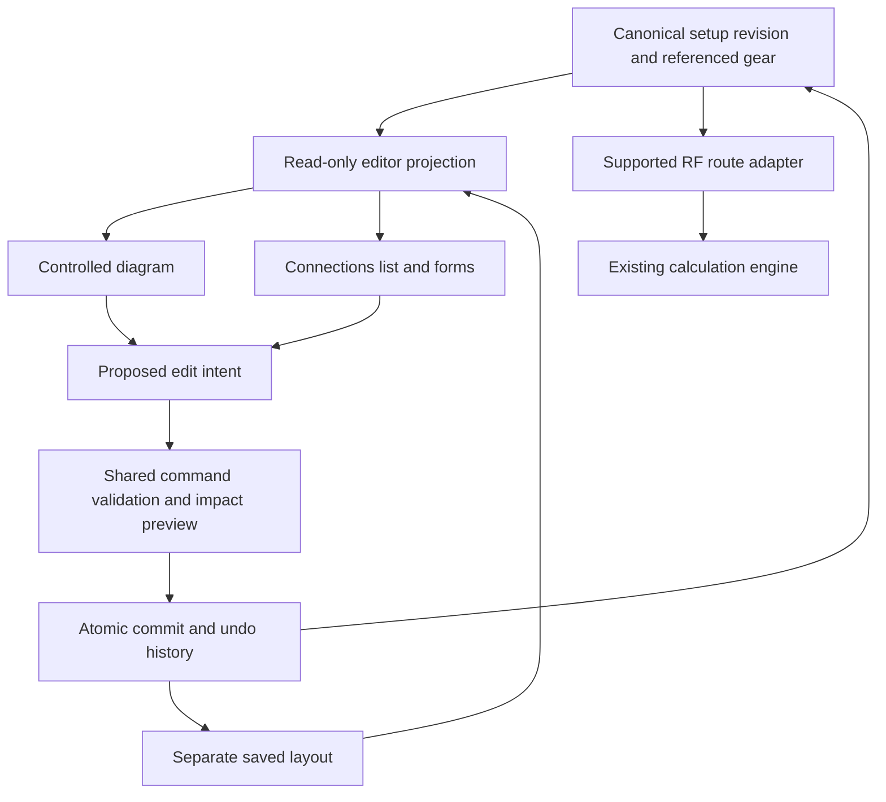

# Station editor architecture

Decision recorded 5 September 2026 for [W01 / #174](https://github.com/crypticpy/propulse/issues/174). **Use a lazy-loaded, controlled React Flow renderer for the editable diagram, with ProPulse domain commands owning every persistent change.** Build the connection list and forms on those same commands. The approved `@/components/station-ui` library supplies the visual language in every view.

This is an architecture decision, not a completed editor integration. W01 adds no graph library dependency and does not replace the current station UI. Package version, actual incremental bundle size, touch behavior and composed accessibility must be verified in [W11 / #184](https://github.com/crypticpy/propulse/issues/184) and [W12 / #185](https://github.com/crypticpy/propulse/issues/185). A failed integration gate requires an explicit decision update and a linked blocker; it does not authorize dropping list parity or silently raising budgets.

## Existing capabilities to preserve

Source reviewed in this checkout:

- [`BuilderCanvas.tsx`](../../../src/components/shack/builder/BuilderCanvas.tsx) already provides wheel zoom, background/middle-button mouse pan, visible zoom controls, selectable equipment, feedline-run detail, connector warnings, per-band performance labels, insertion gaps and drag reordering. Its layout derives from ordered `chain.nodes`, while reorder calls directly into `shackStore`. Pointer/touch and complete keyboard parity are not established by this source inspection.
- [`AllChainsView.tsx`](../../../src/components/shack/builder/AllChainsView.tsx) provides existing construction, inspection, swap and multiple-path flows. Its drop handler accepts `_position` without honoring it, and expansion/duplication use active-chain state. These are migration targets for explicit insertion commands and separate editing/operating selection, not patterns to copy.
- [`stationChainEngine.ts`](../../../src/lib/station/stationChainEngine.ts) remains the calculation foundation behind the supported-route adapter. A renderer must not replace its assumptions or warnings with diagram heuristics.
- Existing inventory metadata, photos, inline components, public sketches, experiments and operating consumers remain in scope. The renderer choice does not authorize removing any feature. The [S01–S17 register](PUNCH-LIST.md) and [delivery plan](DELIVERY-PLAN.md) govern parity and cutover.

Relative source links above are repository links; no local build or interaction result is implied.

## Options and decision

| Option | Fit | Tradeoff and disposition |
|---|---|---|
| Controlled `@xyflow/react` with custom node/edge presentation | Its documented controlled inputs, connection callbacks, identifiable handles and viewport controls fit an adapter over a port/edge graph. | **Default.** Own the command service, domain validation, accessible forms and undo ourselves; isolate the renderer dependency. Integration evidence is still required. |
| Extend the current SVG chain canvas | Reuses existing drawings and adds no graph package. | Retain until replacement parity. Making it a general graph editor also means implementing hit testing, multi-port reconnection, touch gestures, focus navigation and persistent independent layout; the current chain/store coupling makes incremental extension a poor default. |
| New custom HTML nodes with SVG edges | Can directly reuse station primitives and provide precise style control. | Technical fallback if React Flow fails the measured integration gates. It requires the same domain adapter and more owned interaction infrastructure; no evidence currently establishes that its total cost or accessibility would be better. |
| Canvas/WebGL/3D scene as primary editor | Potentially useful for a future physical arrangement view. | Rejected for the primary connection editor: reading, focus semantics and export would require additional representations. W20 still delivers the approved rack/bench view on the same graph; no 3D or bespoke equipment-image prerequisite. |

React Flow accepts controlled node/edge arrays, custom components and event callbacks. This supports our adapter design; it does not supply ProPulse's electrical model or transactional guarantees. [Official component API](https://reactflow.dev/api-reference/react-flow).

Its upstream license is MIT and requires retaining the copyright and permission notice in copies or substantial portions. Verify the selected package and transitive licenses when installed; include applicable notices in distribution. No paid example or subscription is a runtime requirement of this decision. [Upstream license](https://github.com/xyflow/xyflow/blob/main/LICENSE).

## Ownership and command boundary

The diagram and list are two presentations of the same revision, not two stores synchronized by effects. Renderer types must not appear in durable schema, public projections, calculation inputs or migration records. Render-node IDs map to stable equipment-in-setup references; edge IDs map to canonical connections. Handle IDs map to stable port IDs. Array positions, DOM IDs, labels and visual coordinates are never identity.

Multiple handles can be distinguished by IDs in React Flow. We use that presentation capability to expose recorded ports; its source/target handle orientation must not invent a physical port's signal direction or compatibility. [Official handle guide](https://reactflow.dev/learn/customization/handles).

Route all persistent edits through W06's command service:

| Interaction | Required domain behavior |
|---|---|
| Connect/reconnect by handle, button or form | Propose explicit endpoint IDs and cable/run choice. Validate against the same domain rules; show known conflict, unknown compatibility and supported outcomes distinctly. Commit only the accepted proposal. |
| Insert at a gap or inside a run | Carry the intended edge/run and insertion target through preview and commit. Never silently choose the first run or append elsewhere. |
| Remove a selected object | Remove its setup reference or connection through the command service. Shared inventory deletion is a different impact-reviewed action. |
| Drag, keyboard move, reorder or auto-layout | Change layout or explicit list order only. A spatial reorder cannot reconnect gear. One completed gesture is one undoable command, including multi-selection movement. |
| Select, inspect, pan or zoom | Change editor presentation state only. Never select a setup for operation or issue hardware commands. |
| Use in ProPulse | Separate reviewed operation selecting the pinned setup/route/revision via W08; never dispatched as a side effect of renderer events. |

During a drag, keep coordinates in an ephemeral preview. On completion, submit one layout command against the expected layout revision. On cancellation, rejected validation or a concurrent edit, restore the committed projection and explain the result. Do not commit every pointer event. Renderer selection/dimension changes are presentation metadata. Intercept library removal/connect/reconnect events; do not apply convenience edge mutations directly to persisted arrays.

Undo/redo belongs to ProPulse commands, so edits made in the list undo correctly in the diagram and vice versa. Focus recovery uses the affected canonical ID, then the nearest surviving item or initiating control. Deleting a focused item must not strand focus on the document body. Draft undo, comparison restoration and operating selection are separate operations.

## Interaction and visual contract

Use existing station `Button`, `PortButton`, `EquipmentGlyph`, `ConnectionPreview`, fields, notices, badges, dialogs and layout primitives. Compose node content from these building blocks with valid semantics; do not wrap a tile button around other interactive buttons. A node containing controls should retain group semantics. Scope renderer CSS to its editor container and map it to station tokens, including the owner's softer dark/light text, three text sizes, theme choices and visible focus rules in [visual comfort](../station-ui/VISUAL-COMFORT.md). Reuse the actual application header.

The persistent action area shows **Editing**, **Using in ProPulse**, pending draft changes, Undo and Redo. Selection reveals labeled **Connect to…**, **Insert**, **Inspect**, **Move** and **Remove from setup** actions. Connection editing uses explicit From port, To port, cable/run and a plain-language preview. Use inline expansion or a centered station `Dialog`; no browser-edge slide-in/flyout panels.

React Flow documents keyboard focus/selection, arrow-key movement, focus-driven panning and configurable accessibility messages. These provide a starting point, not proof that our composed editor is accessible. Avoid a button role on a wrapper containing interactive descendants. [Official accessibility guide](https://reactflow.dev/learn/advanced-use/accessibility).

Every essential task must also work through click/tap controls and keyboard-accessible list/forms: add custom gear, connect, reconnect, inspect, insert in a named run, reorder, remove, undo and redo. Keyboard support alone does not satisfy the non-drag pointer requirement. The labeled list is available on desktop and mobile, includes port/route names and warnings, and remains usable if the optional diagram chunk fails to load. [W3C dragging movements](https://www.w3.org/WAI/WCAG22/Understanding/dragging-movements.html).

Keep wheel/pinch zoom and background/middle-button pan, with visible zoom-in, zoom-out, fit and reset controls. React Flow documents these viewport interactions; verify the configured behavior on touch hardware in W12. Restrict gesture capture to the diagram so surrounding forms still scroll normally. Provide labeled pan/move controls for non-drag operation. Pinch zoom inside the diagram must not disable browser zoom elsewhere. [Official viewport guide](https://reactflow.dev/learn/concepts/the-viewport).

Connector status, selection, intended route and unsupported analysis use text plus symbols/line patterns, never color alone. Touch action targets follow the station library's comfortable 44-pixel controls. At high text scale or narrow width, the list/forms preserve complete operation; a fit-to-view diagram is not a substitute for readable labels. Reduced-motion settings disable unnecessary viewport animation. Do not announce every transient pointer coordinate.

## Independent layout persistence

Persist node coordinates, groups, explicit arrangement order and layout kind against stable setup/reference IDs in a separate versioned layout record. Diagram and rack/bench layouts are independent. Store camera position/zoom as per-operator view preference; merely looking around does not create a setup revision or alter the selected route. On reopen, validate finite coordinates, clamp viewport limits and restore surviving IDs. New items receive deterministic free positions; removed IDs are ignored without recreating inventory.

Initial layout uses a deterministic ordered placement for supported linear routes and stable placement for additional documented nodes. Auto-layout is an explicit undoable layout command. React Flow does not include an automatic layout engine; external layout packages are optional integrations. Do not install Dagre/ELK speculatively in W01 or make them canonical schema dependencies. [Official layout overview](https://reactflow.dev/learn/layouting/layouting).

Public diagrams and exports render the audience-correct W05 projection, not a filtered screenshot of the private editor. W18 documentation layers and W20 arrangement reuse canonical connections. Neither visibility nor layout creates wiring, sets physical switch state or changes estimates.

## Bundle and integration gate

Known from the repository at this decision: `package.json` has no `@xyflow/react`; [`bundle-budgets.json`](../../../bundle-budgets.json) caps entry JS at 850 KiB raw / 240 KiB gzip, main CSS at 202 / 32 KiB, and PWA precache at 17 entries / 2700 KiB. The checker labels some sizes kB but divides bytes by 1024. There is currently no dedicated editor-chunk budget. These are configured limits, **not measured remaining headroom or a measured React Flow cost**.

W11 must record before/after Vite production measurements on the same base, exact dependency/lockfile version, editor JS plus transitive lazy chunks, CSS, compressed transfer delta, initial route requests and service-worker caching impact. Keep the diagram out of initial application/public-profile loads and preserve all existing limits. Add a meaningful editor budget from the measured integration as part of its review; do not hide cost by considering only one renamed chunk or loosen existing thresholds.

Memoize node/edge components and stable callbacks, and subscribe to narrow projections so a drag does not rerender unrelated inventory/forms. Official guidance identifies unnecessary rerendering and broad node subscriptions as performance risks. Actual performance still depends on our composition. [Official performance guide](https://reactflow.dev/learn/advanced-use/performance).

The W11/W12 evidence must include:

1. Equivalent command results from canvas and list for simple HF, portable/receive-only, shared gear, switched antennas, explicit inline runs, unknown/custom gear and unsupported branches.
2. Insert/reconnect/delete/undo parity, rejected and stale edits, and unchanged operating selection after inspect, move, reopen or layout changes.
3. Mouse, actual touch, keyboard-only and screen-reader task evidence; 320-pixel reflow, browser/text zoom, dark/light/custom themes, reduced motion and monochrome status legibility. Automation supplements manual checks.
4. Measured pan/drag/select/reconnect behavior for ordinary fixtures and a deterministic stress fixture of 100 equipment references / 200 connections, recording browser/device, timing and failures. These counts are test inputs, not a advertised supported-size claim.
5. Layout reopen and cross-view invariants, useful failure fallback, safe export/public projection, and no lost pre-existing feature from the preservation inventory.
6. Repository-required lint, tests, build and bundle checks on the integrated revision, with screenshots from an owned isolated browser session.

No editor integration, bundle delta, device performance or participant validation above has been run as part of this document. W22's real operator validation and W21's controlled cutover remain required. This decision covers the editor architecture criterion of W01; it does not complete the other W01 domain/fixture criteria or close downstream deliverables.
