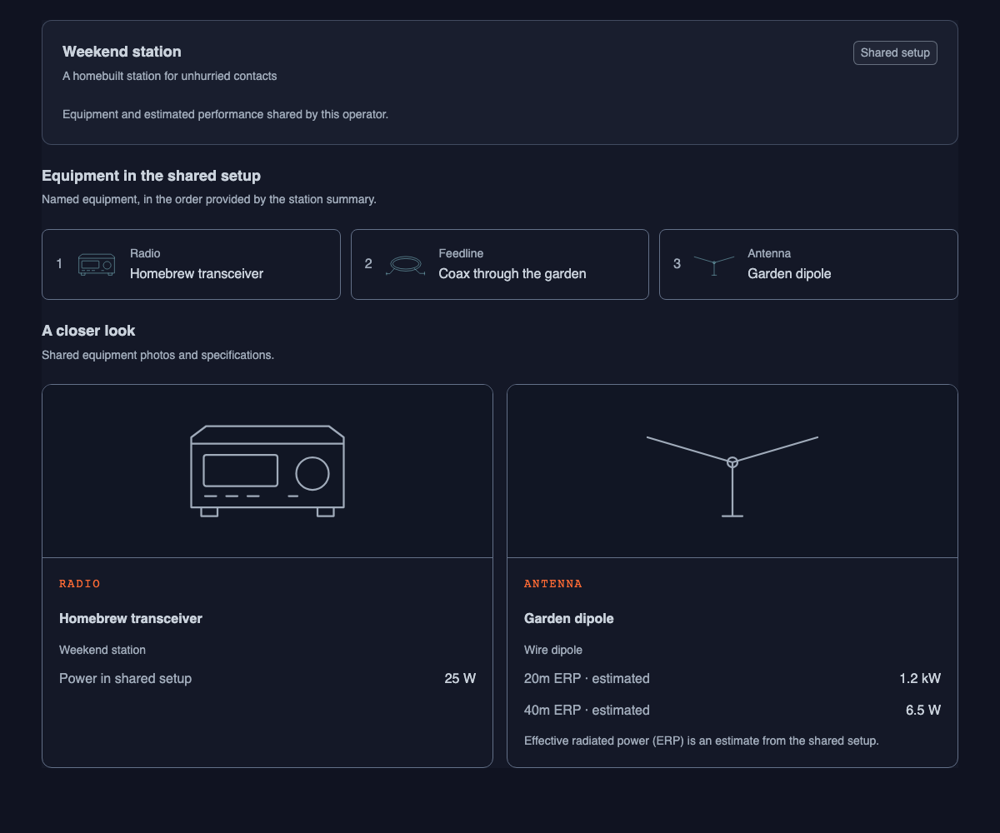
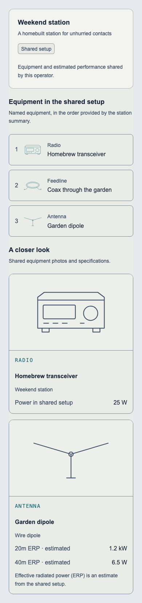

# Public station showcase

The visitor station tab now uses the approved station UI library: a shared setup summary, ordered named equipment, and a closer look at the radio and antenna with shared photos. It replaces collectible equipment cards, so another operator's display no longer depends on the visitor's rank assets or equipment history.

The existing `parsePublicEquipmentSummary` and `usePublicEquipmentImage(ownerUserId, photoId)` remain the data boundary. Names, station text, node labels/order (including duplicates), antenna type, power, ERP and both photo references are retained. Zero watts remains visible; missing or non-finite values read “Not shared.” ERP is explicitly estimated, and the summary does not assert complete wiring or live hardware state. Photo failures fall back to a generic equipment drawing.

This is a presentation increment toward #185, #188 and #189. It does not complete those issues or change publication policy, storage, authentication or profile visibility.

## Validation

- Eight focused component tests: invalid summaries, metadata/node preservation, owner-bound photo lookup, zero/unknown values, no interactive controls and photo failure/replacement.
- Focused and full ESLint, TypeScript and production build passed; normal Git hooks passed (346 test files / 3,106 application tests, 23 harness tests, full build and bundle budgets).
- Actual `PublicShackPanel` rendered in disposable Chromium at dark/light 1200 px, light 390 px and dark 320 px: no horizontal overflow or page errors.

The screenshots below use **synthetic public summary data**, with local-only rendering and no remote requests. They show generic equipment drawings because the fixture has no shared photos. They are component render evidence, not proof of authenticated visitor access, deployed publication or live hardware. The isolated server was verified against checkout `station-public-showcase`, owner `station-public-showcase`, session `ae348046-0c91-4756-bfe9-f8aa71444e85`, and stopped after capture.

