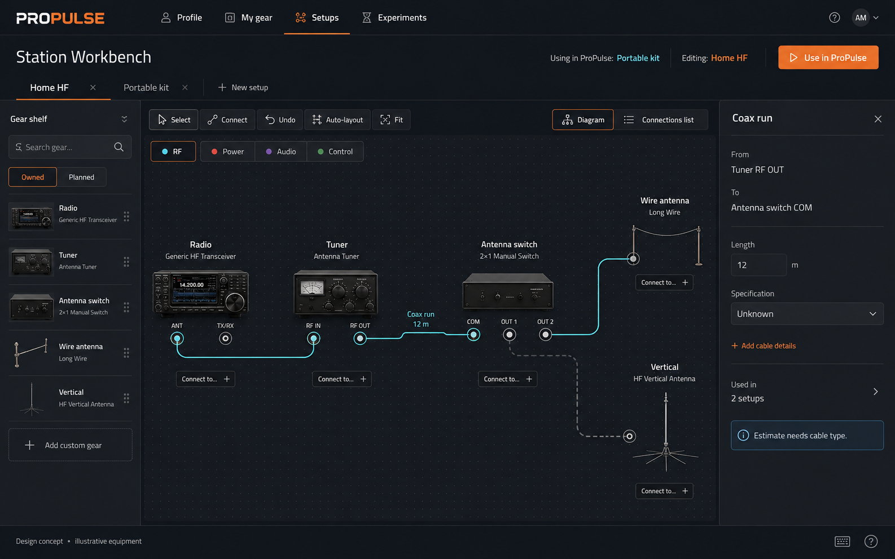
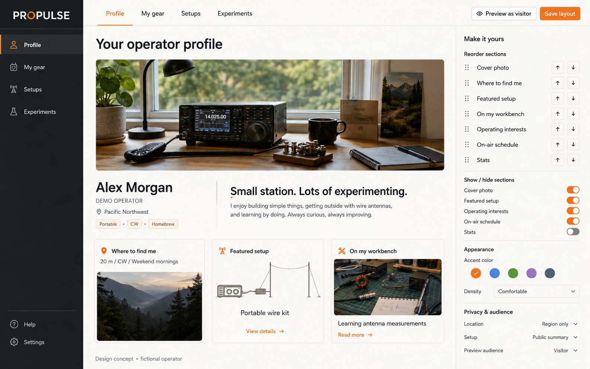
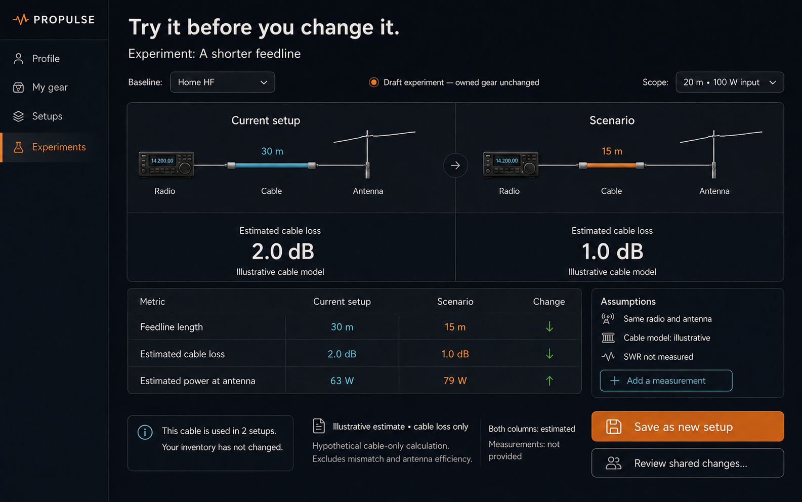
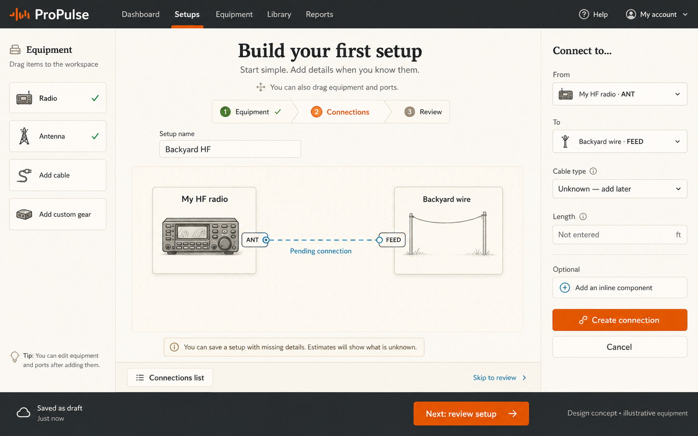

# ProPulse profile and shack: a station workbench

Design proposal · 5 September 2026 · released baseline `d052ec17`

**Make named setups the center of the shack. Give operators a workbench for building them, a separate place to experiment, and a profile that tells their operating story.**

Three agents explored six fictional perspectives: operators aged 35 and 44, two experienced Elmers aged 55 and 60, an interaction designer, and a product/systems designer. They reviewed the code, challenged one another's proposals, and revised their conclusions. This is simulated research for generating hypotheses, not interviews or evidence of market demand. Age was scenario context; experience, station complexity, available time, and input needs drove the recommendations.

The proposal builds on existing inventory, equipment photos, public shack sketches, profile sections, station calculations, and sandbox previews. It does not require replacing everything that already works. No application code or HamClock work was changed.

## The four concepts

### 1. Station Workbench — the recommended direction

A compact gear shelf, a generous editable canvas, and one inspector. Equipment looks recognizable without occupying an entire page of cards. The selected connection exposes its endpoints and cable details. **Editing: Home HF** remains distinct from **Using in ProPulse: Portable kit**.

The canvas opens with RF connections. Operators can reveal power, audio, control, and documented bonding connections as needed. They can drag equipment, but every meaningful action also has an ordinary button or list operation. Layout and wiring are different things: moving a radio changes its position, not its connections.

### 2. Profile Studio — the operator's chosen story

Let people lead with a station photo, what they enjoy, a project they built, and where to find them. Make the featured setup a deliberate choice from the private workshop. Show statistics only when the operator wants them, with computed statistics kept separate from editable biography.

The warm, editorial treatment is an alternative theme, not a requirement that Profile use light mode and Setups use dark mode. Both should support the same theme and density preferences. Use one navigation system in implementation; duplicated navigation in the mock is illustrative.

### 3. Experiments — change an assumption without changing the shack

Compare a working baseline and a named draft. Highlight exactly what changed and explain which outputs are estimates. Prefer **Save as new setup**. Updating shared equipment is a separate action that previews affected setups.

The mock's 2 dB/1 dB and 63 W/79 W values are hypothetical cable-only examples at 100 W input, not specifications or predictions for a real product. They exclude mismatch and antenna efficiency. The existing calculation engine, not image labels, must produce real results.

### 4. Guided start — an easy entrance to the same workbench

**Add radio → Add antenna → Connect → Review.** A basic station should become understandable before all its specifications are known. The connection editor has a clear From, To, cable choice, and Create connection action. Unknown values remain visible and can be completed later.

This is the same setup model and editor as the full workbench, not a separate wizard that leaves users stranded afterward. The image's secondary navigation and unit suffix are illustrative; canonical navigation is below, and lengths follow the operator's unit preference.

## What the discussion changed

The younger portable operator wanted to drag gear immediately. The time-constrained home operator wanted a starting structure. The Elmers wanted complete station documentation, but disagreed about showing every connection type at once. The designers pushed back on building a miniature CAD package before fixing state and editing behavior.

The resulting compromise is **guided construction with progressive detail**: a first RF route that grows into a richer canvas without re-entering gear. The profile takes its personality from operating interests and projects, while the workshop carries technical detail. See the [simulated roundtable](ROUNDTABLE.md) for disagreements and decisions.

## Four areas with clear responsibilities

| Area | Question it answers | Primary content |
|---|---|---|
| Profile | Who am I on the air? | Identity, operating interests, station story, where/when to find me, chosen showcase, optional statistics |
| My gear | What equipment do I have or plan to have? | Physical inventory, custom/homebrew items, photos, notes, specifications, lifecycle, where each item is used |
| Setups | How is this station connected and configured? | Named equipment arrangements, ports, connections, location, intended switch route, power assumptions |
| Experiments | What could I change? | Named alternatives, setup-specific overrides, comparisons, assumptions, measurements, reviewed promotion |

The public profile is a curated projection. It must not publish the raw working inventory or detailed wiring by default.

## What people should be able to put in a profile

Keep existing capabilities and make their arrangement more intentional:

- **Identity and operating context:** callsign, preferred name/pronunciation, region or chosen grid precision, languages, optional license information, portable/club calls where applicable.
- **Where to find me:** preferred bands/modes, favorite frequencies, nets, UTC/local operating windows, QSL preferences, and whether skeds are welcome. Availability should be optional and expire when appropriate.
- **My station:** a chosen setup, concise declared capabilities, station photograph, antenna story, and the constraints that make it interesting—portable, apartment, remote, receive-only, homebuilt, or shared club station.
- **What I enjoy and what I'm learning:** projects, build notes, interests, mentoring offered or requested, current experiments. These should give a small station as much personality as an expensive one.
- **Optional history and achievements:** computed contacts, awards, operating patterns, selected milestones. Keep provenance and privacy, and avoid making a universal score the profile's identity.

Customization should include section order and visibility, featured setup, cover/photo crop, a small accessible accent palette, light/dark theme, and comfortable/compact density. Provide Reset layout and Preview as visitor/friend. Do not require custom CSS or an empty page-builder canvas.

Private inventory may additionally contain serial numbers, receipts, purchase details, firmware, maintenance notes, manuals, exact installation details, and equipment condition. Those should never become public merely because equipment is featured.

## Make the connection editor explain itself

1. Start from a simple template or add a radio/custom item. Required information is minimal; a catalog match is optional.
2. Add an antenna. Present a large **Connect to…** action on the selected equipment and a connection preview.
3. Choose the destination equipment and named ports. Suggest compatible recorded ports, and distinguish unknown compatibility from a confirmed match. A connector shape alone does not establish suitability.
4. Select or create a cable. Attach inline components to that specific run. Permit incomplete documentation while withholding calculations that need missing fields.
5. Select a line to inspect or reconnect it; select equipment to configure it. **Remove from setup** and **Delete inventory item** are separate operations.
6. Save a draft or explicitly choose **Use in ProPulse**. Ordinary editing, inspection, duplicating, and auto-layout never change the operating selection.

Use click-to-connect, a full Connections list, visible focus, sensible focus restoration, and touch-sized controls. Keyboard support alone is not a substitute for a non-drag pointer alternative; WCAG treats those separately. [W3C dragging guidance](https://www.w3.org/WAI/WCAG22/Understanding/dragging-movements.html)

RF is the initial layer. Power, audio, control/data, and documented bonding can follow without implying that they are electrically simulated. Reinforce colors with labels and line styles. Ground symbols should represent recorded connections, not decorative assurances.

## What “use this setup” means

Display two persistent, unambiguous states: **Editing: Backyard HF** and **Using in ProPulse: Portable kit**. Before changing the latter, summarize the setup/location, chosen RF route, entered power/band, missing inputs, and the app contexts that will change.

Edits to the setup already in use also remain a draft, marked **Changes not yet in use**. The operating selection pins a reviewed setup revision and its equipment inputs; Use in ProPulse promotes the new revision. A shared equipment or measurement update is saved with provenance and prompts review for affected setups instead of silently changing their selected configuration or historical log entries. Live conditions and hardware telemetry retain their separate update behavior.

The action selects ProPulse's operating context. It does not assert that a radio is powered, a cable moved, or a physical switch operated. Hardware connection/telemetry has its own source and freshness. Future hardware control should be a distinct, explicit workflow.

Start with one primary operating setup and many saved setups. Model a switch's intended route explicitly; do not infer simultaneous use of every branch. Show **Also used in 2 setups** on shared gear. Setup recall is familiar in radio software—SmartSDR distinguishes global, transmit, and microphone profiles—but ProPulse must define its own narrower app-context behavior. [FlexRadio profile guide](https://www.flexradio.com/documentation/smartsdr-profiles-how-to-guide-pdf/)

## Capabilities that earn trust

Keep four questions separate:

| Question | Appropriate evidence |
|---|---|
| What does the gear support? | Catalog/manufacturer data or the owner's declaration, with missing values shown |
| What does this selected route predict? | Modeled loss/power budget for a specified band, power, and route |
| What has actually been measured? | Measurements with date, frequency, measurement point, method/source, and notes |
| What might be workable now? | A separate path/time/conditions estimate, with uncertainty—not a guaranteed contact |

The existing station engine already carries useful assumptions and warning codes. Surface those beside the result. Replace ambiguous labels such as a bare “ERP” or “Best Band” with the actual metric and an estimate qualifier. Unknown is not zero. Unsupported routing may remain in the drawing while being excluded from calculations.

Named experiments store overrides separately from physical inventory. A preview already uses sandbox copies today; preserve that. The remaining problem is that **Apply to path** can update equipment shared by other setups without an impact review. Do not store a hypothetical SWR value as a measurement.

## What should be built first

The approved [dependency-based delivery plan](DELIVERY-PLAN.md) is now the implementation sequence. It supersedes the earlier recommendation to first patch the existing card editor. With no live users yet, build shared technical foundations first while preserving existing owner/development data.

1. Define contracts, representative fixtures and the editor architecture.
2. Establish equipment/port/provenance models, graph revisions, durable storage/migration, publication boundaries and profile module contracts.
3. Build reversible graph commands, selected-route evaluation, pinned operating context and reviewed experiment promotion.
4. Integrate inventory, canvas/list editing, keyboard/touch access, guided setup and evidence-aware results.
5. Build profile composition, notebooks, typed layers, sanitized exports and the optional rack/bench view on those foundations.
6. Validate with real operators and verify all requirements, data recovery, access boundaries and the deployed cutover.

The [punch list](PUNCH-LIST.md) retains all S01–S17 acceptance criteria. Technical dependencies determine work order; priorities are not separate release promises. Rack/bench arrangement remains in scope as a view of the same topology, with generic equipment support.

## Validate before committing to the full rebuild

Recruit actual operators across simple and complex stations, portable/home/club use, legacy and modern gear, and different input needs. Proposed formative tasks:

- Create a basic radio-to-antenna setup from an empty account without help.
- Add an unknown/homebuilt item and explain what remains uncertain.
- Inspect another setup without changing the one currently used.
- Connect a second antenna through a switch and explain the selected route.
- Compare a different cable without changing the physical inventory.
- Publish a useful profile while keeping private details private.

Suggested prototype targets, not measured results: at least 5 of 6 participants complete the first setup unaided within three minutes; all can identify the editing versus operating setup; no participant unintentionally changes shared inventory; all publication tasks preserve the requested audience. Test the same essential operations with click/tap and keyboard. Revisit the design when observed behavior disagrees with the simulation.

## Scope and evidence

Source inspection and a disposable local browser audit used released commit `d052ec17`. Relevant code findings were rechecked there because the primary checkout contains unrelated uncommitted versions. The current UI captures use synthetic development equipment and are not screenshots of a real user's station. No cloud records or hardware were changed.

All four concepts were generated with the built-in image generation tool, inspected, and saved with their exact prompts in [concepts](concepts/). The experiment image received a targeted revision to remove an ambiguous measurement legend and imprecise chart bars. Generated images communicate direction; the written behavior, graph model, accessibility requirements, and calculated data govern implementation. Equipment imagery and numbers are illustrative.

Design branch: `design/profile-shack-workbench`. The proposal and delivery register are published through the design documentation PR. This is approved planning, not shipped application behavior.
