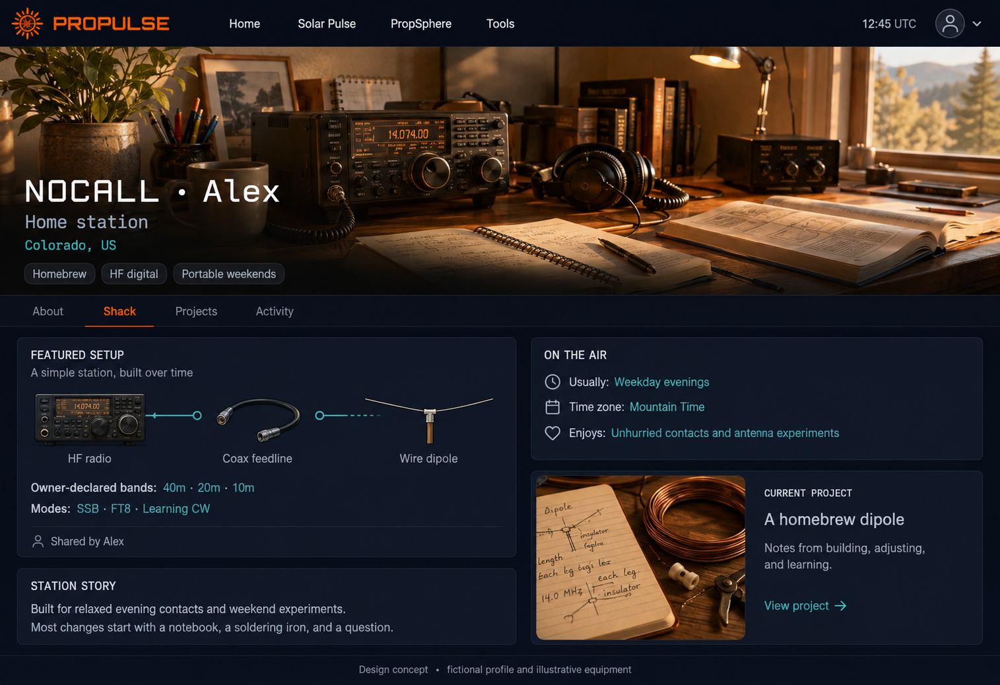
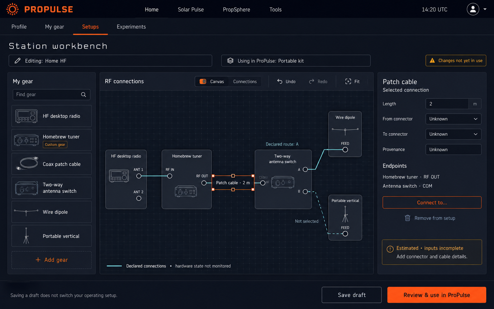
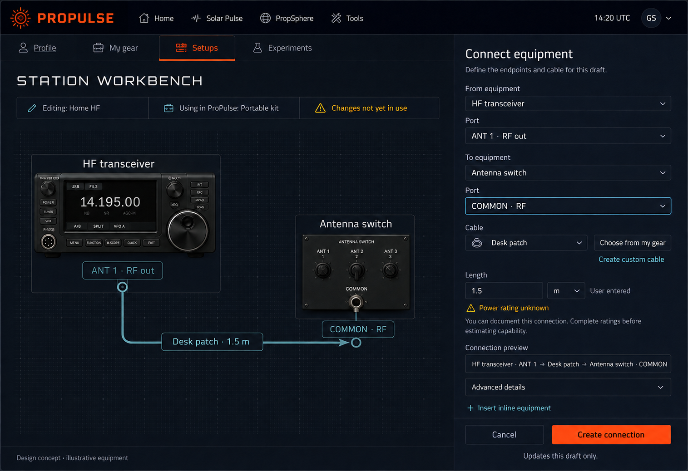
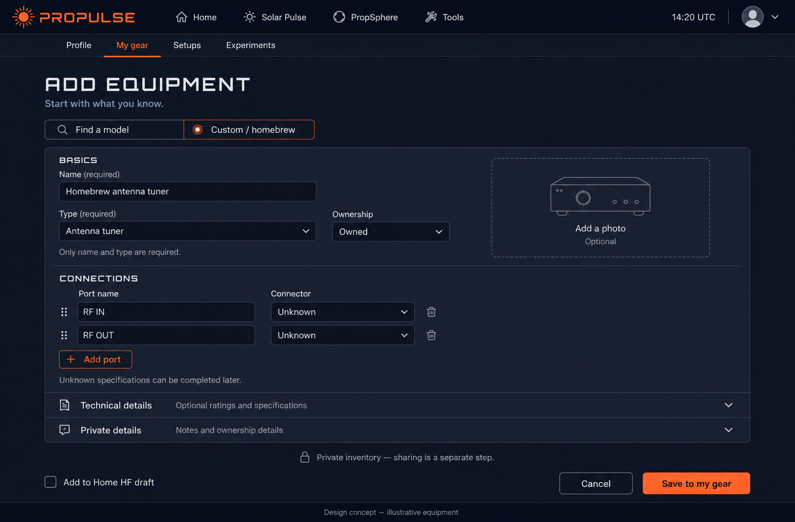
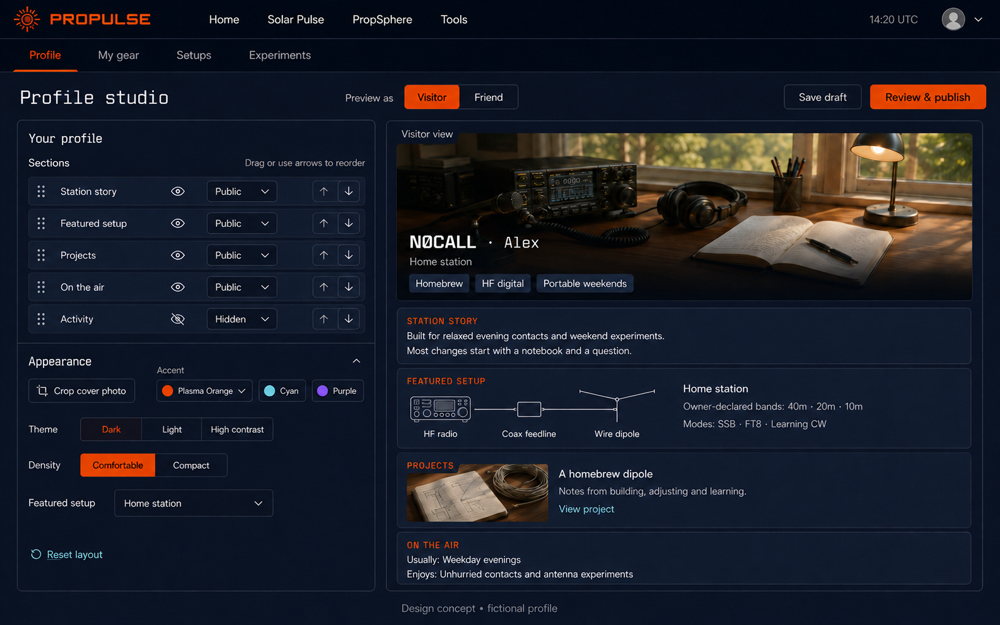

# ProPulse shack visual language

Owner-approved visual direction · 5 September 2026 · source baseline `1a70503b` · approved in conversation

Keep ProPulse's navy and plasma-orange identity, and make the station tools calmer, more legible and easier to operate. The public profile emphasizes the operator's story and chosen setup. The private tools emphasize clear state, connections and useful forms. They share typography, controls, surfaces and navigation.

The owner approved these concepts before requesting the [shared implementation library](../../station-ui/README.md).

These are built-in ImageGen concepts, not application screenshots or implemented behavior. Equipment, identities and sample values are illustrative. The [approved behavior and delivery plan](../DELIVERY-PLAN.md) remain authoritative; this exploration does not change scope or complete an implementation issue.

## The five screens

### 1. Public shack showcase

A chosen station photo, operating interests, a concise featured setup and a project give the page personality. Public detail is deliberately curated. The visitor does not see the owner's private equipment records, working drafts or current operating selection.

### 2. Private station workbench

A compact gear shelf, generous connection canvas and focused inspector replace nested editor modes. Editing, pending changes and Using in ProPulse remain distinct. Text actions and the Connections list complement direct manipulation.

### 3. Connection editor

A focused form makes From, To, named ports and cable selection explicit. This is a closer equipment view; detailed imagery is optional, while generic drawings remain the compact workbench baseline. Show the result before creating it. Put incomplete specifications beside the affected field, and make it clear that creating a connection updates the draft.

### 4. Add equipment

Allow useful inventory records before every specification is known. Custom/homebrew gear receives the same treatment as catalog gear. Keep technical details progressive and private records visibly private.

### 5. Profile composition studio

Edit module order, audience, featured setup and appearance beside a realistic preview. Customization stays inside a coherent design system; it does not require an unrestricted page builder.

## Shared visual rules

| Element | Proposed treatment | Existing anchor |
|---|---|---|
| Background and surfaces | Deep chrome `#0a0a1a`, reading surface `#141827`, raised panel `#191e2e`, input `#111624` | Global dark theme and the quieter Home surface palette |
| Primary action | Plasma orange `#ff6b35` with very dark label `#111624` | Existing plasma accent |
| Links and connection emphasis | Muted cyan `#85c4d0`; restrained teal for RF paths | Home cyan and existing feedline teal |
| Text | Primary `#e2e8f0`; supporting `#a0abba` | Existing slate/grey text family, made consistent |
| Typography | Inter for prose/forms, JetBrains Mono for callsigns/units, Orbitron used sparingly for brand/headings | Existing three font families |
| Shape and spacing | 8px control radius, 12px panels, 4/8px spacing rhythm, 24–32px section gaps | Existing spacing/radius tokens |
| Controls | Persistent labels, comfortable targets, icon plus text, visible focus, one primary action per working area | Existing accessible interaction direction |
| Atmosphere | Restrained color and photography; minimal stars only outside working content | ProPulse's space identity without competing with forms/data |

The proposed solid-color text pairs have calculated contrast ratios of 13.45:1 for primary text on panel, 7.13:1 for secondary text on panel, 6.36:1 for dark text on orange, and 8.53:1 for cyan links on panel. These are palette calculations, not a claim that generated raster screens or future implementation have passed an accessibility audit. Real components still need focus, zoom, input, contrast and assistive-technology verification.

## Component behavior belongs in the language

- **Buttons:** filled orange for the current primary action; outlined secondary actions; explicit labels for destructive or shared-record operations. Saving a draft and using it are distinct actions.
- **Inputs:** labels stay visible, units have a clear home, help text explains what to enter, and errors appear beside the affected field. Unknown is a useful explicit state.
- **Connection lines:** endpoints are named; selected routes are distinguishable by label and line style. Inactive branches are visually quieter. Drawing a line does not assert hardware state or electrical safety.
- **Badges:** Draft, In use in ProPulse, Estimated, Measured, User entered and Unknown have words as well as color. Provenance and operating state are different categories.
- **Panels:** strong hierarchy comes from spacing and headings. Avoid a new card around every value. Use a right-side inspector for the selected object and full-width forms when the task needs space.
- **Profile modules:** move up/down controls accompany drag handles; audience controls sit near content; preview uses the same audience projection as publication.
- **Customization:** retain the existing dark, light, high-contrast and midnight theme system and accent presets. These images explore the default dark/plasma combination. Final components should consume semantic theme tokens, not introduce a fixed palette per screen. Theme, density, text scaling and reduced motion remain coherent across public and private areas.

## Source and traceability

Visual anchors: `src/styles/design-tokens.css`, `src/styles/globals.css`, `src/styles/home.css`, `tailwind.config.js`, `src/lib/themes/index.ts`, and the captured baseline UI in [evidence](../evidence/).

These concepts inform [W01 architecture and workflows](https://github.com/crypticpy/propulse/issues/174), [W10 inventory](https://github.com/crypticpy/propulse/issues/183), [W11 workbench](https://github.com/crypticpy/propulse/issues/184), [W12 accessible editing](https://github.com/crypticpy/propulse/issues/185), [W13 guided setup](https://github.com/crypticpy/propulse/issues/186), and [W16 profile composition](https://github.com/crypticpy/propulse/issues/189). No delivery status changes are implied.

The [exact prompt set](PROMPTS.md), [shared generation brief](GENERATION-BRIEF.md), and [asset manifest](manifest.json) preserve the generation instructions and selected outputs. Images are saved as new assets; the earlier concepts remain intact. The connection form received a targeted header correction for consistent orange branding and a simple UTC readout.

Raster review notes: generated wordmarks and equipment markings vary slightly, and the public featured-setup connectors are illustrative. Reuse the actual brand assets and font tokens in implementation; render topology from recorded ports and connections. Final control sizing, focus behavior and audience enforcement require component-level verification rather than copying pixels from these images.
