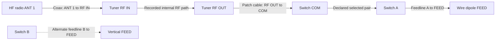
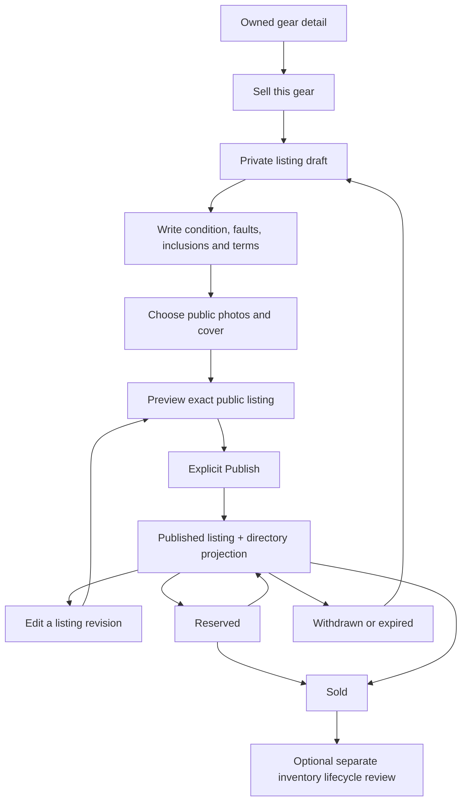

# Screens and interaction sketches

These wireframes specify relationships and actions; the [concept gallery](gallery.html) explores the visual treatment. Navigation names are proposed additions to the existing routes, not a reason to remove existing profile tabs or operating tools.

## One station, two useful diagram views

```text
EXISTING PROPULSE HEADER
My shack / Home HF                  Edit | Present | Photos
Editing: Home HF · draft            Using in ProPulse: Portable kit
Pending changes                    Undo   Redo   Save draft
────────────────────────────────────────────────────────────────
GEAR SHELF             CANVAS | CONNECTIONS
Search                 Select · Connect to · Insert · Inspect
Radio / Tuner / …       Align · Distribute · Group · Auto-arrange
+ Custom gear
                       [Desk group]           [Outside group]
                       Radio → Tuner → Switch ┬→ Wire dipole
                                              └⇢ Vertical
                       Fit / zoom / pan controls · route legend
```

Select an item → inline action toolbar. Choose **Connect to** → a centered dialog with From item/port, To item/port, cable/run, compatibility and preview. Save creates one graph command. Choose **Inspect** → a centered equipment/connection dialog; close it before entering a separate confirmation flow. Context menus may be shortcuts, never the only entrance.

**Authoritative fixture:** these are port-to-port connections, not links created by physical position. Solid means the featured documented route; dashed means an alternate connection, not a broken cable. The declared internal switch pairing is COM→A. This is not a hardware-state monitor.



COM and B belong to the same switch, but no selected COM→B path is asserted in this fixture. The implementation groups the switch's ports into one node. Estimates bind the selected route/revision/inputs; missing inputs produce Unknown rather than a fabricated wattage.

```text
PRESENT — OWNER REFERENCE OR PUBLISHED SNAPSHOT
Home HF · A simple station built over time
Featured route: Wire dipole      Diagram | Connections | Photos

 Radio ─── Tuner ─── Switch ───── Dipole
                        └ - - - Vertical (alternate)

 Named endpoints · connection legend · optional estimated detail
 Short station story / purpose / constraints
 [Operating desk photo] [Antenna photo] [Project detail photo]
 Owner: Edit this setup | Choose presentation layout | Publish…
 Visitor: permitted equipment detail / photo viewer only
```

Publish → choose revision, featured route, audience, displayed fields/media → review the actual audience projection → publish. Re-entering Edit or moving a node does not update that snapshot. A mobile reader can switch to the same named connection list rather than reading microscopic labels in a scaled-down diagram.

## Personal profile and galleries

```text
[Wide banner image — independent crop for this placement]
[Avatar] Callsign / chosen name / coarse region / story
Existing profile destinations + Photos | My shack | Gear for sale

PHOTOS                              MY SHACK
[Album cover] [Album cover]          Featured published setup
Title / visible photo count         Clean diagram / chosen photos
                                    Explore station details
```

Owner: Add photos → select/create album → upload with progress → order/caption/alt text/cover → choose audience → preview → save/publish. Selecting a photo as a banner creates another placement with its own crop; it does not publish that photo's entire album. Preserve existing About, stats, records, awards, social and contact destinations as modules/tabs, even where the concepts simplify navigation.

Viewer: click thumbnail → large image with caption, optional credit/date, position counter and thumbnails → Previous/Next or swipe → optional zoom/reset → Close/Escape returns focus and scroll to the original thumbnail. No autoplay. If the item disappears or access changes, stop exposing adjacent unauthorized images and restore focus to a valid surviving control. The daylight rendering can represent an owner looking at a private album; its background privacy label is not evidence of public visibility.

## Listing a piece of gear

### Put photos on the gear first

```text
MY GEAR / ITEM DETAIL
[Equipment image or empty-photo placeholder]   Add photos / Manage photos

CENTERED PHOTO MANAGER
Upload images | Paste image link
Image URL [ https://example.com/my-radio.jpg ]  Preview image
[Decoded preview / source / result]            Import image

[Cover ✓] [Photo 2] [Photo 3]  Add more
Set cover · Move earlier/later · Caption / alt text · Crop · Remove
Save photos / Cancel
```

Imports create managed images in the owner's library. Saving photos does not publish the item; setup, profile and listing flows choose their own shared photos. Empty gear supports the same photo actions for radios, antennas, cables, inline devices and accessories. Link failures keep the URL and other gear fields available for correction.



Reserved→Published revalidates availability; Sold→relist requires an explicit new draft/review rather than an accidental toggle. Status changes and search invalidation are coordinated server-side.

```text
SELL THIS GEAR                        PUBLIC PREVIEW
Source: My homebrew tuner             Selected cover photo
Title / category                     Title · seller · coarse region
Condition / known faults             Condition / asking terms
What's included                      Write-up and selected photos
Write-up
[Choose photos from gear library]
Amount + currency OR Contact for price
Pickup / shipping / coarse region
Contact preference
Save draft                Preview listing → Publish
```

Private inventory remains the source of the ownership link. The public preview contains only selected fields; it is not a card showing the entire inventory object. If a private item changes, suggest a reviewed refresh without silently changing the listing. A For sale badge on gear points to this listing, and the directory points back only to permitted profile/shack content.

## Directory and individual listing

```text
GEAR FOR SALE
Search gear…                    Category | Condition | Region
Price terms / currency          Pickup / shipping | Sort
────────────────────────────────────────────────────────────
[Photo] Title        [Photo] Title        [Photo] Title
Condition            Condition            Condition
Asking terms         Asking terms         Asking terms
Coarse location      Coarse location      Coarse location
Seller               Seller               Seller

LISTING DETAIL
[Large cover / thumbnails]       Title / availability
                                Asking amount + currency or contact
                                Seller / coarse region / terms
Description                     Contact seller
Known faults / included items   Report listing
Updated date / selected related public shack link
```

Contact seller → authenticate if needed → compose an inquiry tied to the listing → send once → clear delivery result. The proposed relay does not publish email/phone automatically and does not imply payment handling. When a listing becomes unavailable, the detail page states that clearly and disables new sale inquiries unless the owner explicitly supports follow-up; the directory's available results remove it.

## What users should understand without instruction

- Moving a box changes the drawing; connecting named ports changes the documented setup.
- Present is a reading mode. Publish is a sharing action. Use in ProPulse is an operating-context action.
- Personal albums tell the operator's story. Setup photos explain a station. Gear photos document an item. Sale photos support a selected listing.
- A public listing does not make an entire private shack public.
- Sold is an availability state, not an instruction to erase inventory or history.
