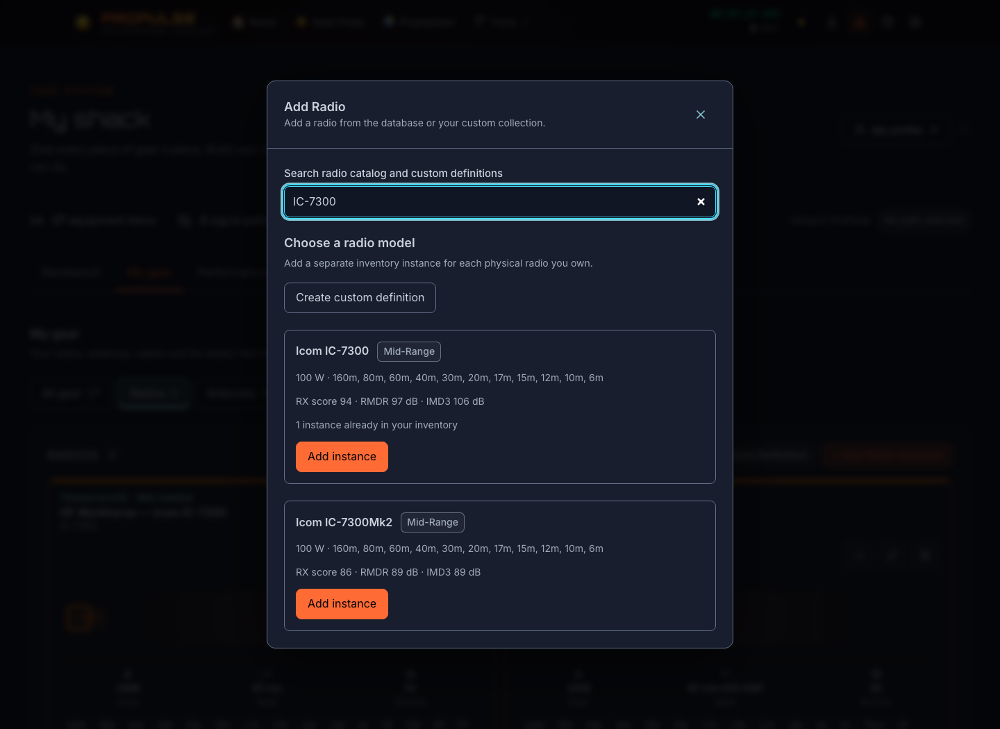
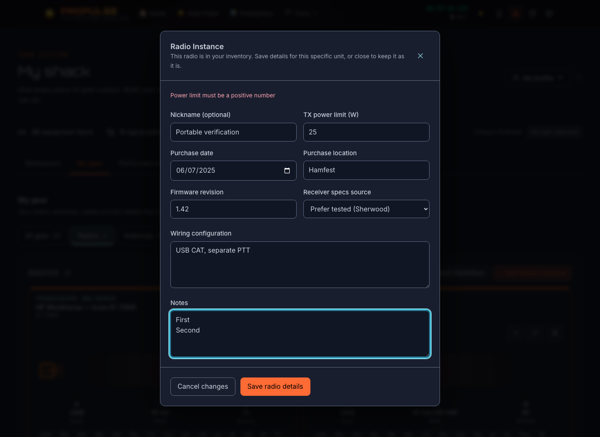
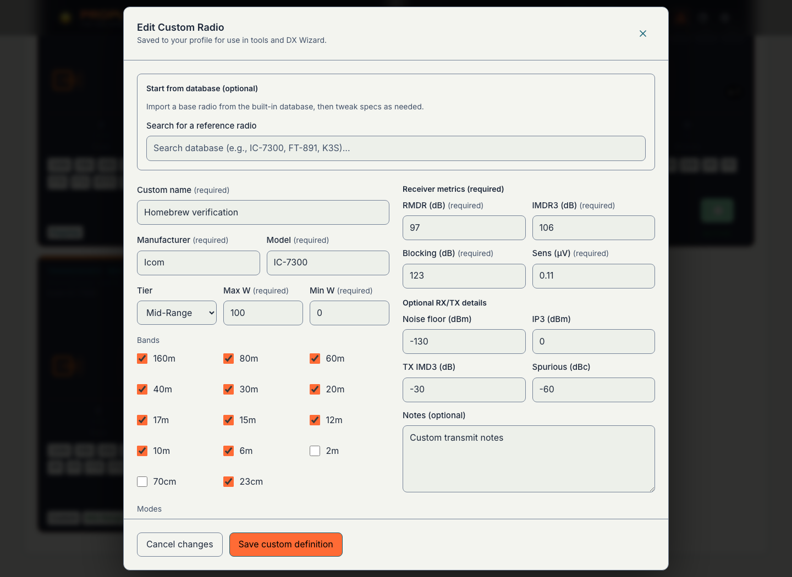
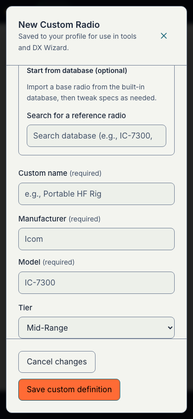

# Radio equipment forms

Delivery slice for [W10 #183](https://github.com/crypticpy/propulse/issues/183) and [the station workbench program #173](https://github.com/crypticpy/propulse/issues/173). This independent radio-form release complements [the shack/profile UI PR #265](https://github.com/crypticpy/propulse/pull/265).

The real radio catalog picker, owned-radio editor and custom-definition editor now use the approved station controls, soft reading palettes and centered focus-managed dialogs. Search/filtering, factory versus tested reference imports, radio instance metadata, all receiver/transmitter fields, bands/modes, equipment limits, deletion checks and photo associations retain their existing stores and behavior. The catalog makes selecting a model a keyboard-operable button. Fields have persistent labels; primary actions use contrasting text and forms preserve multiline notes.

The shared Dialog accepts an optional overlay layer, forwarding the existing RadioManager nesting contract. Its default layer is unchanged. Two regression cases cover default and explicit layers; the existing station library tests cover dialog focus and Escape behavior.

## Verification and evidence

The source-checkout browser verification used an owned local-profile server and disposable synthetic browser data. It exercised catalog keyboard selection, invalid/valid instance power, instance metadata and photo-ID preservation after reload, custom factory/tested imports, zero/signed specifications, bands/modes, reference-search Enter without submission, multiline notes, custom-definition-to-instance references, light/dark themes, 390px mobile containment and Escape. These checks establish local UI behavior; they do not establish authenticated cloud sync or hardware control. This release copies the four reviewed source files and applies formatting only before the release gates.

Release checks: focused station dialog/library tests; repository pre-commit lint; pre-push full application lint/tests/build and bundle budgets. The PR records final check results.

