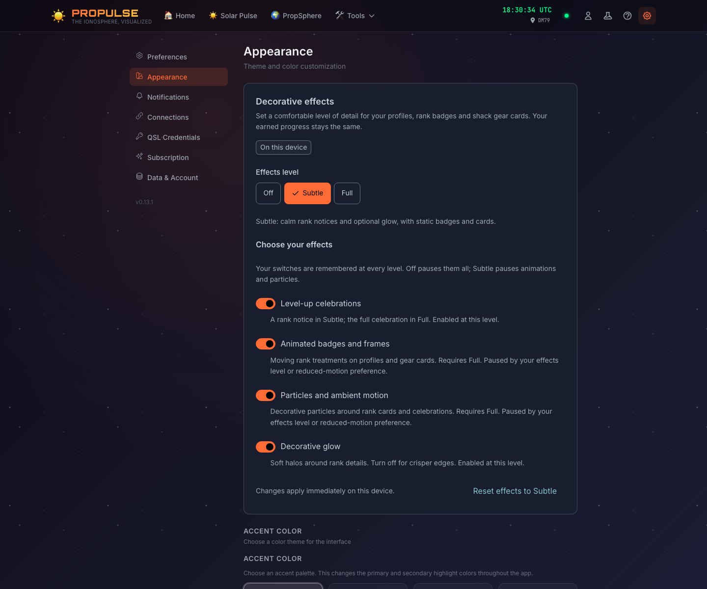
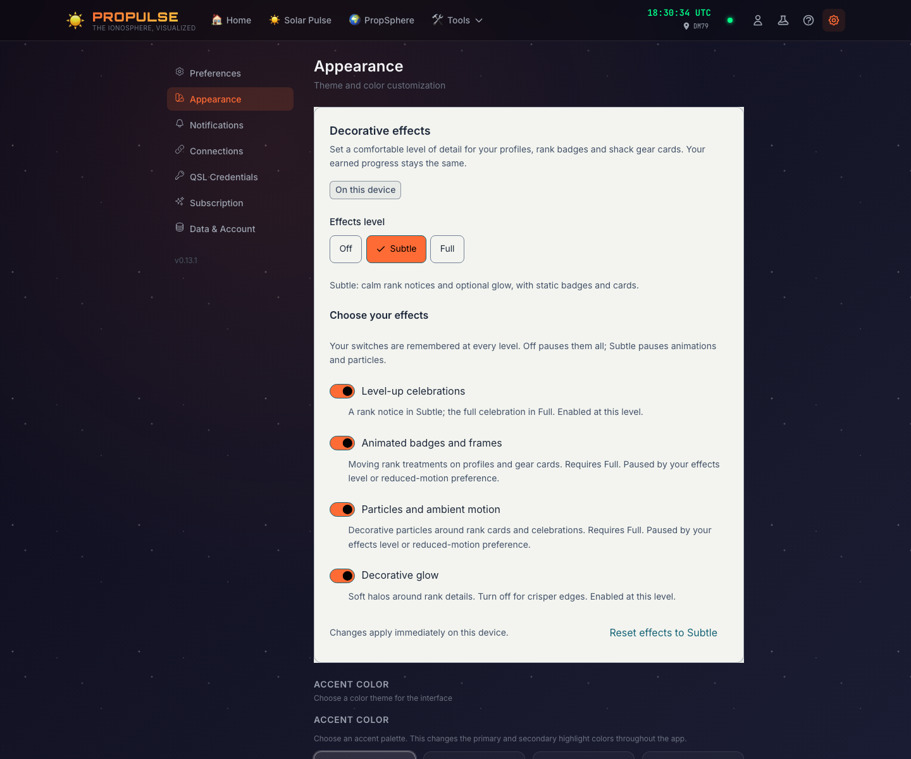

# Local decorative effects — delivery evidence

Issue [#318](https://github.com/crypticpy/propulse/issues/318), independent child of
[#291](https://github.com/crypticpy/propulse/issues/291). Covers SX2:T01 and the
local comfort, persistence and verification portions of T05/T06/T08.

Settings → Appearance now starts with device-local Off / Subtle / Full controls.
Subtle is the initial setting for both new and previously unconfigured devices:
rank notices are static, badges/cards do not move, and glow remains optional.
Four saved switches are capped by the level and the live OS reduced-motion
preference. Existing theme/accent choices and legacy particle/tilt opt-outs remain.

Rank decoration in the header, owner/visitor profiles and gear cards uses the
viewer’s resolved policy. Off removes open celebrations immediately and consumes
suppressed transitions, including future-dated synced transitions, without changing
rank points/history/unlocks. Radio alerts, active-equipment indicators, maps and
HamClock retain their operational behavior.

The version-1 `propulse-visual-effects` storage envelope contains only five local
preferences. Invalid/unknown envelopes use calm defaults; storage failure exposes
a temporary-preferences notice and retry. Saved toggles survive level changes,
reloads and tab synchronization. No cloud, publication or theme payload changes.

## Verification

- Policy/store tests: preset and individual switches, validation, reload/reset,
  unavailable storage/retry, cross-tab events and live reduced-motion changes.
- Rank tests: progression persistence stays mounted, immediate suppression and no
  replay across remount, in-flight count-up cancellation, particle removal, static
  rank identity, focus preservation and calm/full celebration behavior.
- Browser: actual `/settings/appearance`, mouse/keyboard controls, reload and
  cross-tab synchronization, OS changes, four theme contrast/accessibility checks,
  390 px viewport and 200% root text. A real MouseTilt fixture verifies equal
  grid-row heights, click state and stable focus across Subtle/Off/Full.
  Disposable local UI contexts; no account,
  public profile publication or cross-device cloud sync is claimed by this check.

Repeat the browser check after reading the local testing guide and starting an
owned managed local-profile server in this checkout:

```sh
node scripts/check-appearance-effects.mjs http://127.0.0.1:<owned-port>
```

Results and screenshots are written to ignored `tmp/effects-check/`. Dark/light
review screenshots accompany this document. Full lint, tests, build and bundle
checks and the final merge/deployment references are recorded on the PR and issue.

## Remaining parent scope

#291 remains open for account defaults, hiding rank modules, published profile
appearance, custom themes and author/viewer publication precedence. This delivery
does not close those requirements or bypass their #178/#188 dependencies.

## Review screenshots




