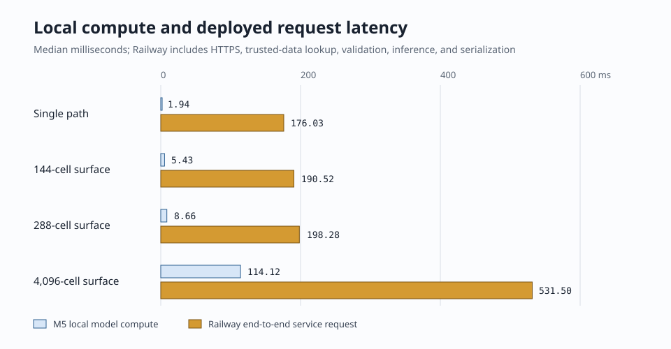
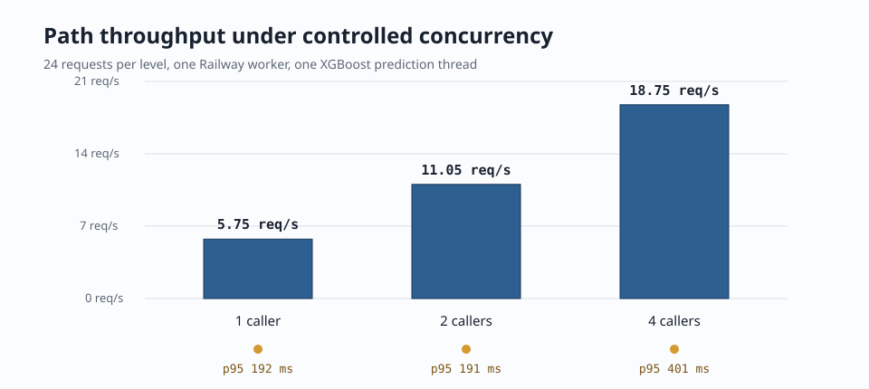

# A6 Cloud Deployment Verification Report

> **Decision:** the private cloud inference path is ready for Propulse product
> integration. The exact 50-million-row A6 bundle is running in Railway, the
> Vercel boundary keeps service credentials off the browser, and a registered
> ephemeral user received both a genuine fresh-history NowCast and a personalized
> StationCast result. This is an engineering deployment milestone, not a claim
> that prospective validation or FutureCast evidence is complete.

Measured July 17, 2026 UTC on the M5 against the deployed preview. The raw
receipts are [`cloud_smoke_receipt.json`](cloud_smoke_receipt.json) and
[`cloud_benchmark.json`](cloud_benchmark.json).

## What is running

```text
Registered Propulse user
        |
        | Supabase JWT, same-origin request
        v
Vercel /api/propagation/*
        |
        | private service token, schema limits, timeout, trace ID
        v
Railway FastAPI service
        |                         |
        |                         +-- Supabase verified WSPR lag features
        |                         +-- Supabase operational solar weather
        v
Checksum-verified A6 + physics bundle
```

The loaded model is
`propagation_v4_2_phase2_scale-a6-retrospective-internal-50000000`. Railway is
configured for one Uvicorn worker and one XGBoost prediction thread. The service
is in `shadow` mode: private predictions are available, but beta outcome receipts
and public-release claims remain off.

## End-to-end proof

| Check | Result |
|---|---:|
| Supabase ephemeral-user token | 200 |
| Vercel health proxy | 200 |
| Vercel capabilities proxy | 200 |
| Vercel personalized path proxy | 200 |
| Anonymous direct Railway request | rejected |
| Exact A6 model loaded | yes |
| Verified WSPR history used | 1,800 seconds old |
| Operational weather used | 5,400 seconds old |
| Returned profile | `nowcast` |
| FutureCast exposed | no, correctly gated |
| Ephemeral user deleted | yes |

The representative EM10-to-IO91 20m WSPR fixture returned a core probability of
**12.29%** and a deterministic station-personalized probability of **27.92%**.
That difference proves that the same deployed request can combine the open A6
path estimate with a virtual-shack equipment chain. It does not prove that every
equipment change causes an equivalent real-world improvement; the station layer
is a deterministic link-budget adjustment and remains explicitly labeled.

The response carried `missing_features`, 37.0% confidence, source freshness,
and predictive top-factor metadata. The product must show those qualifications
rather than presenting the number as certainty.

## Latency



The local M5 benchmark isolates model compute. The Railway benchmark includes
internet transit, trusted-data RPCs, request validation, model work, response
validation, and JSON serialization. That is why a 1.94 ms local path prediction
is a 176.03 ms median cloud request. The useful product number is the deployed
one; the local number confirms the model itself is not the bottleneck.

| Request | Samples | Median | p95 | Maximum |
|---|---:|---:|---:|---:|
| Personalized path, sequential | 30 | 176.03 ms | 343.77 ms | 370.64 ms |
| 144-cell surface | 10 | 190.52 ms | 569.25 ms | 569.25 ms |
| 288-cell surface | 10 | 198.28 ms | 226.82 ms | 226.82 ms |
| 4,096-cell surface | 10 | 531.50 ms | 655.51 ms | 655.51 ms |

Ten samples are enough for deployment smoke sizing, not a long-term service-level
objective. The 144-cell p95 was driven by one 569 ms outlier and should be
re-measured by continuous monitoring.

## Concurrency



The single worker scaled from 5.75 requests/second with one caller to 18.75 with
four callers because much of each request waits on external feature/weather I/O.
At four callers p95 rose to 401 ms, still suitable for interactive use. This does
not justify increasing XGBoost threads: the model compute is already small, and
extra native threads would make memory and tail latency less predictable.

## Memory and capacity

The production-path M5 process loaded the model in **2.424 seconds**, reached
**1,160 MiB** RSS after load, and peaked at **1,180 MiB** after a 4,096-cell
surface. A 1 GiB container cannot safely run this bundle. Start with:

| Resource | Initial setting | Reason |
|---|---:|---|
| RAM | at least 2 GiB per replica | about 820 MiB headroom over measured peak |
| CPU | 1 vCPU minimum | external lookups dominate the warmed request path |
| Uvicorn workers | 1 | each worker loads another model copy |
| XGBoost threads/request | 1 | prevents oversubscription and stabilizes tails |
| Horizontal replicas | 1 initially | measured private-preview load is far below capacity |

Use actual Railway memory/CPU monitoring to decide when to add a replica. A
practical trigger is sustained p95 above 750 ms, memory above 80%, or request
queueing under real private use. Scale replicas before increasing model threads.
Exact monthly cost remains provider-plan dependent and must be recorded from
the Railway billing meter after a representative week; request timing alone
cannot produce a defensible dollar estimate.

## Method

The no-secret driver
[`benchmark_cloud_inference.py`](../../../../src/archive_v4_2/benchmark_cloud_inference.py)
used one persistent HTTP client, three warmups, 30 sequential path calls, 24 path
calls at each concurrency level, and ten surfaces at 144, 288, and 4,096 cells.
The fixture uses a consistent 25 W station chain and unique Maidenhead grid
targets. HTTP errors fail the run. The JSON receipt contains the unrounded output.

The authenticated smoke created a confirmed random Supabase account, signed in,
called the protected Vercel routes, verified the exact model/profile and
personalized response, and deleted the account in a `finally` block. No real user
record, training row, raw shack inventory, service credential, or service-role
key is present in these artifacts.

## Limits and next action

- A6 is still retrospective/internal. The locked prospective outcome evaluation
  remains unread and unchanged.
- FutureCast is correctly unavailable. Synthetic pipeline success is not a real
  future forecast.
- The deployment has readiness health checks. The scheduled GitHub uptime and
  model-identity workflow is implemented and activates on the default branch;
  provider-meter billing measurement still requires representative private use.
- WSPR operational-use permission remains an explicit general-release dependency.
- Band Planner and the core/personalized 324-cell ReachMap are now integrated
  and authenticated on desktop and mobile. The consolidated research, serving,
  product, and QA result is in
  [`../product_integration/REPORT.html`](../product_integration/REPORT.html).

The cloud path itself no longer blocks product integration.
